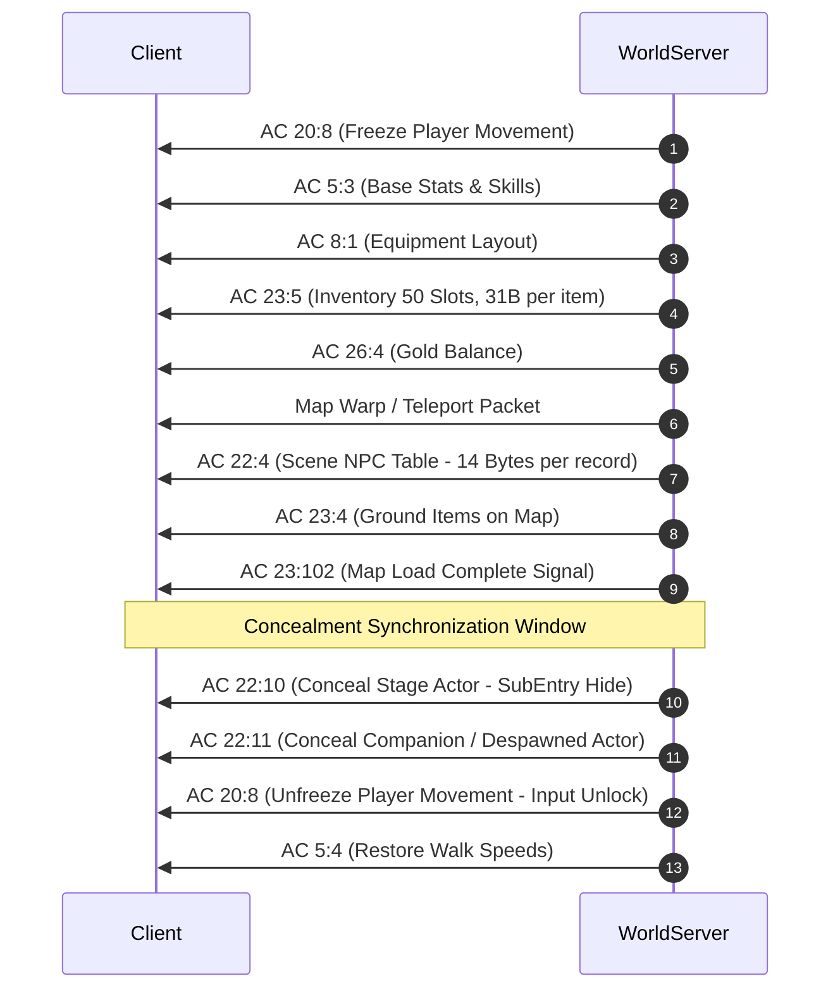
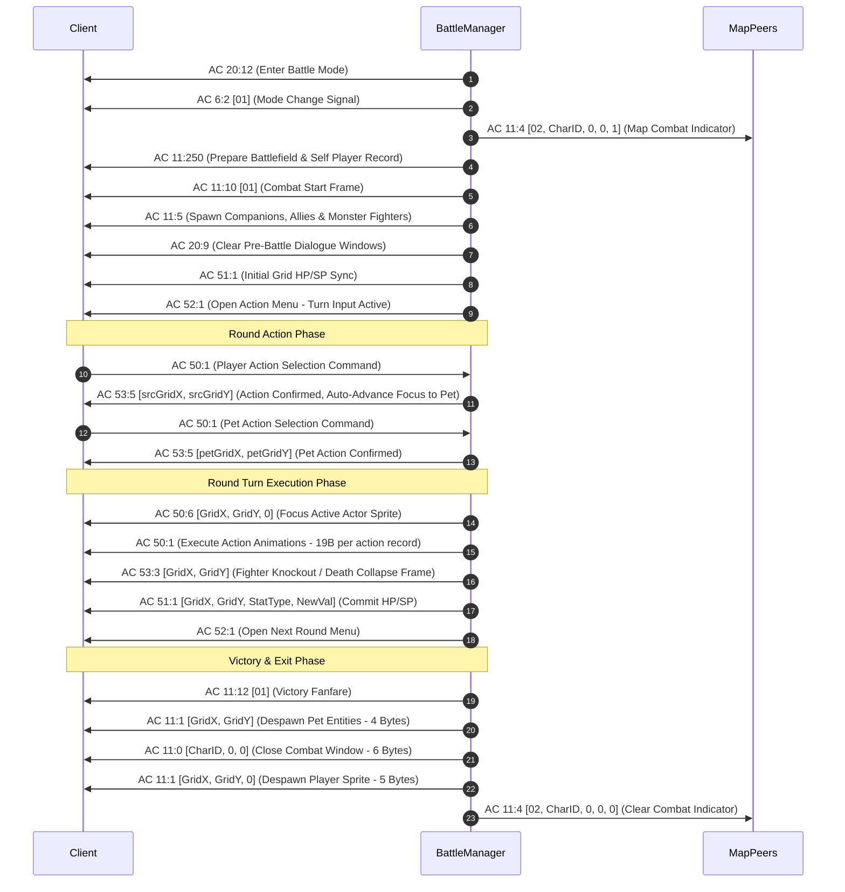
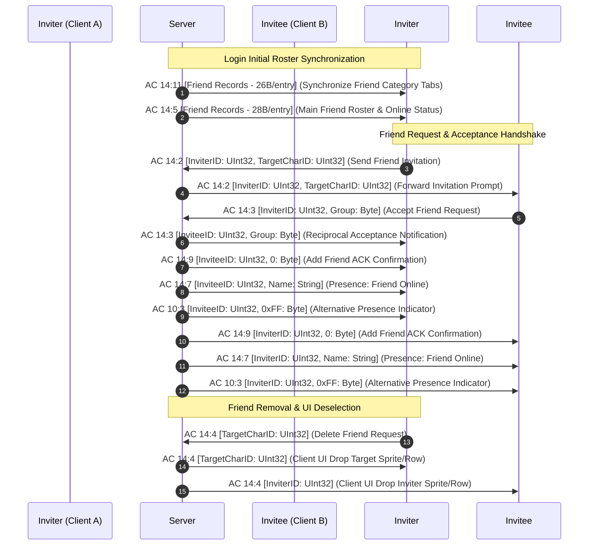
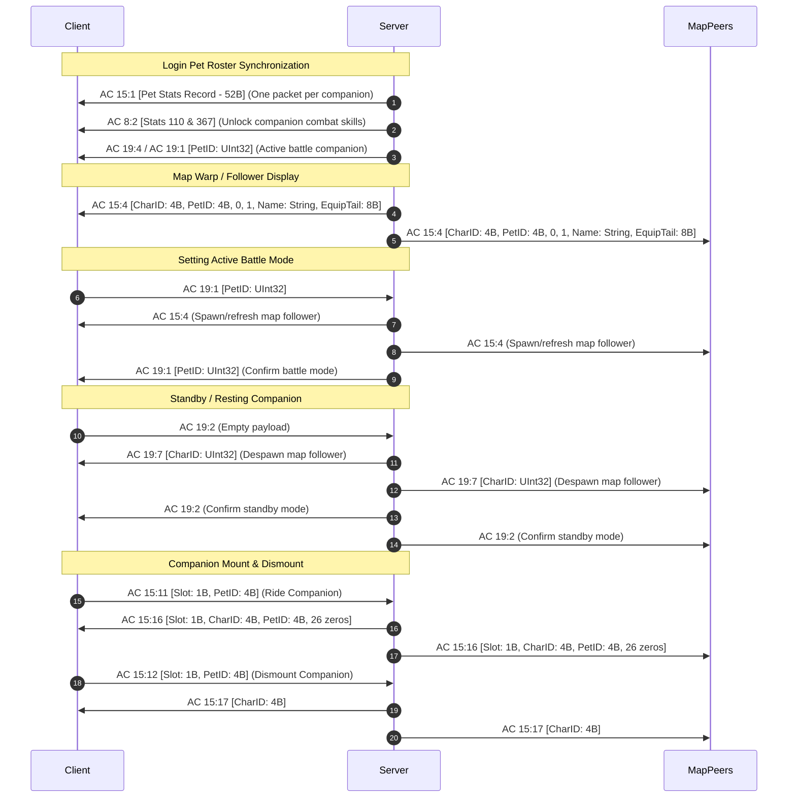

# Network Protocol Specification and Action Code Catalog

## 1. Low-Level Transport Architecture

Wonderland Online (WLO) communication operates over persistent, bi-directional TCP sockets. The server architecture uses an asynchronous socket framework with dedicated listener and processing loops across isolated endpoints:

* **Authentication & Login Server:** TCP Port `6414` (Account verification, character slot enumeration, character creation/deletion).
* **World Game Server:** TCP Port `6415` (In-game simulation, map replication, entity movement, combat, quests, inventory).
* **Item Mall Server:** TCP Port `6416` (Microtransactions, promotional point balances, item catalog delivery).
* **Account Registration API:** HTTP/TCP Port `8080` (External account onboarding).

All network byte order follows Little-Endian convention for integers (`short`, `ushort`, `int`, `uint`, `long`, `ulong`).

---

## 2. Binary Wire Framing & Packet Anatomy

Every packet exchanged between the client and server is framed by a 4-byte header preceding the variable-length payload.

```
+-------------------+-------------------+-------------------+-------------------+
|     Byte 0        |      Byte 1       |      Byte 2       |      Byte 3       |
+-------------------+-------------------+-------------------+-------------------+
|  Magic Low (0xF4) | Magic High (0x44) |  Length Low (LSB) |  Length High (MSB)|
+-------------------+-------------------+-------------------+-------------------+
|     Byte 4        |      Byte 5       |      Byte 6 ... N                     |
+-------------------+-------------------+-------------------+-------------------+
| Action Code (AC)  |   SubCode (Sub)   |         Variable Payload Data         |
+-------------------+-------------------+-------------------+-------------------+
```

### 2.1 Header Field Definitions

1. **Magic Header (2 Bytes - `0x44F4`):**
   * Byte 0: `0xF4` (`244` decimal)
   * Byte 1: `0x44` (`68` decimal)
   * Verified upon intake. If a packet stream diverges from `0x44F4`, the socket buffer is flushed or terminated to prevent desynchronization attacks.

2. **Payload Length (2 Bytes - `UInt16`):**
   * Defines the total number of bytes following Byte 3 (inclusive of the Action Code, SubCode, and Payload data).
   * Minimum valid length is `1` (an Action Code byte without subcode or payload).

3. **Action Code (1 Byte - `Byte`):**
   * Identifies the primary subsystem or functional domain responsible for processing the packet (e.g., `AC 22` for Scene Entities, `AC 23` for Bag/Item subsystems).

4. **SubCode (1 Byte - `Byte` - Optional/Domain-Specific):**
   * Categorizes the discrete operation within the Action Code domain. In the server dispatch layer, the subcode is often read via `packet.B ?? 1`.

### 2.2 Packet Serialization Engine (`Tools.FromFormat`)

Packet serialization is executed either through `SendPacket` directly or formatted via [`Tools.FromFormat`](file:///D:/GitHub/Wonderland-Private-Server/wlo.pserver.core/Generics/Tools.cs#L18):

```csharp
// Formatting Type Legend:
// 'B' or 'b' -> 1 Byte  (byte)
// 'W' or 'w' -> 2 Bytes (ushort, Little-Endian)
// 'D' or 'd' -> 4 Bytes (uint / int, Little-Endian)
// 'L' or 'l' -> 8 Bytes (ulong / double, Little-Endian)
// 'S' or 's' -> Prefixed String / String bytes

SendPacket pkt = Tools.FromFormat("bbw", 62, 53, 2);
player.Send(pkt);
```

---

## 3. Core Action Code (AC) Catalog

Below is the authoritative catalog of Action Codes implemented across [`Src/Network/ActionCodes/`](file:///D:/GitHub/Wonderland-Private-Server/Src/Network/ActionCodes):

| Action Code | Name / Domain | Primary Direction | Functional Purpose |
|:---:|:---|:---:|:---|
| **0** | `AC0` (Heartbeat) | Bi-directional | Null keep-alive ping and socket health verification. |
| **1** | `AC01` (Auth Handshake) | Bi-directional | Handshake synchronization, timestamp negotiation, client token checks. |
| **2** | `AC02` (Chat Channel) | Bi-directional | Local map talk, whisper/PM, team chat, guild broadcast, GM broadcast (`:cmd`). |
| **3** | `AC03` (Avatar Init) | Server -> Client | Character identity initialization, base model, gender, hair, elemental type. |
| **4** | `AC04` (Entity Replication) | Server -> Client | Replicates remote player visual entities, Guild IDs, titles, flags to client viewport. |
| **5** | `AC05` (Attributes & State) | Bi-directional | Movement lock/unlock, base stats (`5:3`), walk speed, hotbar/quickbar (`5:24`). |
| **6** | `AC06` (Facing / Direction) | Bi-directional | Entity orientation changes across 8 compass directions (0 to 7). |
| **7** | `AC07` (Emotes & Gestures) | Bi-directional | Character animation triggers (wave, sit, cry, laugh, bow, cheer). |
| **8** | `AC08` (Equipment System) | Bi-directional | Gear changes, equip/unequip operations (`8:1`), durability updates. |
| **9** | `AC09` (Character Creation) | Client -> Server | Character creation form intake (slot index, name, model, color, stats allocation). |
| **10** | `AC10` (Social Relations) | Bi-directional | Friend list invitations, acceptances, friend removal. |
| **11** | `AC11` (Combat Battlefield) | Bi-directional | Turn-based battle initialization, grid matrix, combat participant entry. |
| **12** | `AC12` (Tent Housing) | Bi-directional | Tent deployment, interior transition, furniture placement, storage boxes. |
| **13** | `AC13` (Player Trade) | Bi-directional | Secure 1-on-1 trading window, item locking, gold staking, transaction commit. |
| **14** | `AC14` (Mail & Social Status)| Bi-directional | In-game mailbox read/send/claim attachments, friend online/offline broadcasts. |
| **15** | `AC15` (Vehicles & Mounts) | Bi-directional | Mount boarding, vehicle controls, 7-step raft shore shipwreck sequence. |
| **16** | `AC16` (Party / Team) | Bi-directional | Party creation, member invites, party leader transfers, team formation. |
| **18** | `AC18` (Player Killing / PK)| Bi-directional | Open-world duel challenges, PK state toggles, combat arena flags. |
| **19** | `AC19` (Pets & Companions) | Bi-directional | Pet roster updates, summoning, riding, intimacy/loyalty adjustments, AI mode. |
| **20** | `AC20` (Cinematics & Input) | Bi-directional | Cutscene timelines (`20:1`), ACK syncing (`20:6`), mobility freeze/unfreeze (`20:8`). |
| **21** | `AC21` (Map Portals & Warps) | Bi-directional | Portal transition validation, map boundary crossings, warp triggers. |
| **22** | `AC22` (Scene Entities) | Server -> Client | 14-byte scene table (`22:4`), path walking (`22:2`), entity concealment (`22:10`/`22:11`). |
| **23** | `AC23` (Inventory & Ground) | Bi-directional | Bag data (`23:5`), ground items (`23:4`), item pick (`23:2`), gold banner (`23:6`), map ready (`23:102`). |
| **24** | `AC24` (Client Settings) | Bi-directional | User preferences, sound/music flags, trade block, refuse duel flags. |
| **25** | `AC25` (System Prompts) | Server -> Client | Modal popups, system notifications, banner announcements, warning dialogues. |
| **26** | `AC26` (Currency & Gold) | Bi-directional | Character gold balances (`26:4`), bank transactions, storage gold. |
| **27** | `AC27` (Player Titles) | Server -> Client | Achievement titles, badge unlocks, active overhead title display. |
| **11** | `AC11` (Battle Scene Engine) | Bi-directional | Battlefield init (`11:250`), start (`11:10`), fighter spawn (`11:5`), despawn (`11:1`), window exit (`11:0`), map combat broadcast (`11:4`), victory fanfare (`11:12`). |
| **28** | `AC28` (Production Craft) | Bi-directional | Material processing, synthesis tables, workbench operations. |
| **29** | `AC29` (Alchemy Synthesis) | Bi-directional | Multi-item compounding, recipe validation, success/fail roll handling. |
| **30** | `AC30` (Tent Storage Bag) | Bi-directional | Secondary inventory storage within tent containers and cabinets. |
| **31** | `AC31` (Pet Storage Hotel) | Bi-directional | Storing inactive pets/human companions in farm or hotel slots. |
| **32** | `AC32` (Garage System) | Bi-directional | Large transport vehicle docking, repair, fuel reloading. |
| **33** | `AC33` (Gathering & Fishing)| Bi-directional | Resource node gathering, fishing rod state, periodic loot drop rolls. |
| **34** | `AC34` (Player Stall) | Bi-directional | Personal merchant stall setup, item pricing, public kiosk browsing. |
| **35** | `AC35` (Mall User Auth) | Server -> Client | Item Mall token authentication and player identity synchronization (`35:11`, `35:12`). |
| **36** | `AC36` (Blacksmith Refining)| Bi-directional | Weapon/armor enhancement, refining scroll application, durability repair. |
| **37** | `AC37` (Gem Socketing) | Bi-directional | Socketing gems into equipment slots, socket punching, extraction. |
| **39** | `AC39` (Quest Progression) | Bi-directional | Quest tracking updates, quest book state, milestone flags. |
| **40** | `AC40` (Auction House) | Bi-directional | Public marketplace listing, bidding, buyout transactions, payout delivery. |
| **41** | `AC41` (Marriage System) | Bi-directional | Couple proposal, wedding ceremony triggers, relationship skill unlocks. |
| **43** | `AC43` (Master-Apprentice) | Bi-directional | Mentorship pairing, graduate rewards, apprentice quest hand-ins. |
| **45** | `AC45` (Daily Rewards) | Bi-directional | Consecutive login streaks, daily gift package claiming. |
| **50** | `AC50` (Combat Actions) | Bi-directional | Player action commands (`50:1`), action clear frames (`50:6`), action execution animations (`50:1`). |
| **51** | `AC51` (Combat Stat Sync) | Server -> Client | Real-time combat entity HP/SP synchronization (`51:1` [GridX, GridY, StatType, NewVal]). |
| **52** | `AC52` (Combat Turn Prompt)| Server -> Client | Turn prompt signal (`52:1`) reopening action selection menu for participating players. |
| **53** | `AC53` (Combat Grid Events) | Server -> Client | Fighter action acknowledgment (`53:5`), fighter death frame (`53:3`), loot drops (`53:4`). |
| **62** | `AC62` (Interface State) | Server -> Client | GUI window states, minimap markers, special icon overlays. |
| **63** | `AC63` (Login Server Auth) | Bi-directional | Account credential handshake, slot data (`63:2`), session handoff to World. |
| **75** | `AC75` (Item Mall Catalog) | Bi-directional | Catalog browsing, point balances, purchasing transactions. |
| **90** | `AC90` (Client Sync) | Server -> Client | Client sync initialization, environment parameters, frame timing. |
| **91** | `AC91` (Guild Organization) | Bi-directional | Guild creation, roster membership, guild bank, guild rank permissions. |
| **104** | `AC104` (Lucky Draw) | Bi-directional | Daily lucky draw / spin wheel minigame (`104:1`). |
| **183** | `AC183` (Arena Ladder) | Bi-directional | Ranked PvP matchmaking, leaderboard standings, arena records. |
| **184** | `AC184` (Guild War) | Bi-directional | Territorial war flags, stronghold capture timers, siege scoring. |
| **186** | `AC186` (Cinematic Playback)| Server -> Client | Complex camera animation scripts, NPC stage direction sequences. |
| **191** | `AC191` (Pet Rebirth / Amity)| Bi-directional | Pet reincarnation, stat redistribution, memory wiping. |
| **199** | `AC199` (Pet Skill Train) | Bi-directional | Teaching companion-specific abilities, skill book application. |
| **226** | `AC226` (Event Mini-Games) | Bi-directional | Seasonal arcade minigames, racing, quiz challenges. |

---

## 4. In-Depth Subsystem Protocols

### 4.1 Login, Authentication & Character Selection (`AC 63`)

1. **Client -> LoginServer (`Port 6414`):**
   * Transmits encrypted username and password credentials.
2. **LoginServer Verification:**
   * Queries `users` SQLite table. If valid, queries `characters` table for all characters matching `user_id`.
3. **LoginServer -> Client (`AC 63:2`):**
   * Encodes up to 2 character slot structures (Model ID, Level, Name, Equipped visual items).
4. **Client Character Select (`AC 63:5`):**
   * Client selects Slot 0 or 1. Server produces session handover token, directs client to `WorldServer` on `Port 6415`.

### 4.2 Map Initialization & Entity Concealment Handshake (`AC 22`, `AC 23`, `AC 20`)

When a player enters a map (either via login or portal transition), the server strictly enforces the following sequence:



#### 4.2.1 14-Byte Scene Entity Structure (`AC 22:4`)
For every NPC resident on the loaded map, the server streams a continuous binary array where each NPC occupies exactly 14 bytes:
* **Offset 0..1 (`UInt16`):** Scene Entry Index / Unique Map NPC ID.
* **Offset 2..3 (`UInt16`):** Template NPC ID (references `Npc.dat`).
* **Offset 4..5 (`UInt16`):** X Coordinate.
* **Offset 6..7 (`UInt16`):** Y Coordinate.
* **Offset 8 (`Byte`):** Entity Visibility & Interaction Flag (`0x01` = Active/Visible, `0x02` = Concealed/Ghost).
* **Offset 9 (`Byte`):** Facing Direction (`0` through `7`).
* **Offset 10 (`Byte`):** Movement Behavior (`1` = Static, `2` = Patrol, `3` = Random Wander, `5` = Path).
* **Offset 11 (`Byte`):** Animation / Stance state.
* **Offset 12..13 (`UInt16`):** Bounding Roam Range / Anchor radius.

### 4.3 Inventory & Ground Item Protocol (`AC 23`)

* **AC 23:5 (Bag Item Update - 31 Bytes):**
  Each inventory slot is serialized into 31 bytes specifying: Slot Index, Item ID, Quantity, Current Durability, Max Durability, Socket Count, Socketed Gem IDs, and Enhancement Level.
* **AC 23:4 (Ground Item Replication):**
  Dispatches items resting on map terrain: Ground Index, Item ID, Grid X, Grid Y, Quantity.
* **AC 23:2 (Item Pickup Request):**
  Client sends ground item index to pick up. Server verifies bounding distance `<= 150` units, removes ground entry, inserts into player bag, and broadcasts item despawn.
* **AC 23:6 (Gold / Currency Banner):**
  Triggers overhead visual floating currency or cash drops.

### 4.4 Raft Shore Shipwreck Sequence (`AC 15`)

When a player navigates a wooden raft into shore barrier boundaries:
1. `AC 15:14` - Raft crash animation trigger.
2. `AC 23:9` - Raft item consumed / removed from inventory.
3. `AC 15:15` - Player dismounted to walking state.
4. `AC 15:11` - Raft entity despawn broadcast to local map peers.
5. `AC 5:4` - Player movement speed recalibrated to land velocity.

### 4.5 Combat Protocol & Action Sequence (`AC 11`, `AC 50`, `AC 51`, `AC 52`, `AC 53`)

The combat lifecycle follows the official packet capture sequence recorded in `session_20260911_150803`:



#### 4.5.1 Combat Action Animation Record (`AC 50:1` Server -> Client)
Each action execution entry sent by the server during turn resolution is serialized into exactly 19 bytes:
* **Offset 0..1 (`UInt16`):** Animation Record Header (`0x0011`).
* **Offset 2 (`Byte`):** Source Fighter Grid X.
* **Offset 3 (`Byte`):** Source Fighter Grid Y.
* **Offset 4..5 (`UInt16`):** Skill ID (`10001` = Basic Attack, or specific skill ID).
* **Offset 6..7 (`UInt16`):** Animation SubType / Sequence flag (`0x0100`).
* **Offset 8 (`Byte`):** Target Fighter Grid X.
* **Offset 9 (`Byte`):** Target Fighter Grid Y.
* **Offset 10..12 (`3 Bytes`):** Action hit result flags (`0x01, 0x00, 0x01`).
* **Offset 13 (`Byte`):** Damage Type / Stat Type (`0x19` = HP Damage, `0x1A` = SP Damage).
* **Offset 14..17 (`UInt32`):** Damage / Heal numeric value (Little Endian).
* **Offset 18 (`Byte`):** Target status flag (`0x01` = Active, `0x00` = Defeated).

#### 4.5.2 Combat State Indicator Record (`AC 11:4` Server -> Map Peers)
Broadcast to map peers when a player enters or exits battle mode to control the overworld crossed-swords animation above the character:
* **Offset 0 (`Byte`):** Record SubType / Category (`0x02`).
* **Offset 1..4 (`UInt32`):** Character ID (`CharID` in Little-Endian).
* **Offset 5 (`Byte`):** Unused / Reserved (`0x00`).
* **Offset 6 (`Byte`):** Unused / Reserved (`0x00`).
* **Offset 7 (`Byte`):** Battle Flag (`0x01` = In Battle / display crossed swords, `0x00` = Out of Battle / clear swords).

> [!NOTE]
> Serialized directly using strongly-typed [`SendPacket.Pack32`](file:///D:/GitHub/Wonderland-Private-Server/wlo.pserver.core/Network/Packet.cs#L48) rather than `Tools.FromFormat` to avoid signed/unsigned byte conversion overflow exceptions (`System.OverflowException`) when formatting 32-bit character identifiers.

---

### 4.6 Social & Friend System Protocol (`AC 14`)

Friend synchronization and relationship lifecycle management strictly mirrors captured network traffic on TCP Port 6414:



#### 4.6.1 Friend Binary Record Layouts
* **Tab Synchronization (`AC 14:11` - 26 Bytes/Friend):**
  * `Offset 0..3 (UInt32)`: Character ID.
  * `Offset 4 (Byte)`: Level.
  * `Offset 5 (Byte)`: Job / Rebirth Class.
  * `Offset 6 (Byte)`: Element (`1=Earth, 2=Water, 3=Fire, 4=Wind`).
  * `Offset 7 (Byte)`: Body Type.
  * `Offset 8 (Byte)`: Head Type.
  * `Offset 9..16 (UInt16 x 4)`: HairColor, SkinColor, ClothingColor, EyeColor.
  * `Offset 17.. (String)`: Character Nickname / Name (length-prefixed).
* **Main Roster Synchronization (`AC 14:5` - 28 Bytes/Friend):**
  * Extends `AC 14:11` layout with Guild Name string (`""`) and trailing Online Status flag Byte (`0x01` = Online/Green, `0x00` = Offline/Grey).

> [!NOTE]
> Serialized directly using strongly-typed [`SendPacket.Pack32`](file:///D:/GitHub/Wonderland-Private-Server/wlo.pserver.core/Network/Packet.cs#L48) rather than `Tools.FromFormat` to avoid signed/unsigned byte conversion overflow exceptions (`System.OverflowException`) when formatting 32-bit character identifiers.

---

### 4.7 Pet & Companion Lifecycle Protocol (`AC 15` & `AC 19`)

Verified against official network captures (`session_20260911_150803`):



#### 4.7.1 Companion Binary Packet Specifications
* **Overworld Map Visual Follower (`AC 15:4`):**
  * `Offset 0..3 (UInt32)`: Owner Character ID (`CharID`).
  * `Offset 4..7 (UInt32)`: Companion Template / NPC ID (`PetID`).
  * `Offset 8 (Byte)`: Sub-mode flag (`0x00`).
  * `Offset 9 (Byte)`: Active state flag (`0x01`).
  * `Offset 10.. (String)`: Companion name (1-byte length prefix).
  * `Trailing 8 Bytes`: Companion weapon and visual equipment padding (`[0, 0, 0, 0, 0, WeaponLo, WeaponHi, 0]`).
* **Companion Battle Spawn Record (`AC 11:5` - 32 Bytes):**
  * `Offset 0 (Byte)`: Team Side (`0x05` for Friendly Pets, `0x01` for Enemy Monsters).
  * `Offset 1 (Byte)`: Entity Type (`0x04` for Pets, `0x07` for Monsters, `0x02` for Players).
  * `Offset 2..5 (UInt32)`: Entity Identifier (`PetID`, `MonsterID`, or `CharID`).
  * `Offset 6..7 (UInt16)`: Pet Slot index (in friendly pet list) or ClickID (for monsters).
  * `Offset 8..11 (UInt32)`: Owner Character ID (or `0` for monsters/players).
  * `Offset 12 (Byte)`: Battlefield Matrix Grid X coordinate.
  * `Offset 13 (Byte)`: Battlefield Matrix Grid Y coordinate.
  * `Offset 14..17 (UInt32)`: Max HP.
  * `Offset 18..19 (UInt16)`: Max SP.
  * `Offset 20..23 (UInt32)`: Current HP.
  * `Offset 24..25 (UInt16)`: Current SP.
  * `Offset 26 (Byte)`: Element (`0=Earth, 1=Water, 2=Fire, 3=Wind`).
  * `Offset 27 (Byte)`: Level.
  * `Offset 28 (Byte)`: Reborn flag.
  * `Offset 29 (Byte)`: Job / Class flag.
* **Pet Stat & Skill Sync Record (`AC 8:2` - 13 Bytes Payload):**
  * `Offset 0 (Byte)`: Target Type indicator (`0x04` strictly designates Pet record; values != 4 are treated as player attributes).
  * `Offset 1..2 (UInt16)`: Pet Roster Slot (`1..4`).
  * `Offset 3..4 (UInt16)`: Stat Identifier:
    * `0x0119` (281): Current HP
    * `0x011A` (282): Current SP
    * `0x011D` (285): Level
    * `0x0129` (297): STR
    * `0x012A` (298): CON
    * `0x012B` (299): INT
    * `0x012C` (300): WIS
    * `0x012D` (301): AGI
    * `0x016F` (367): Skill Tree Node Unlock / Proficiency Exp
  * `Offset 5..8 (UInt32)`: Value 1 (CurHP, CurSP, Level, or Skill Proficiency / Grade).
  * `Offset 9..12 (UInt32)`: Value 2 (Skill ID when Stat is `0x016F`, otherwise `0x00000000`).
