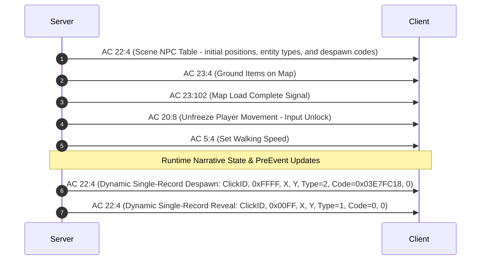

# Map Engine, Scene Simulation, and Entity Lifecycle

## 1. Architectural Overview

The map engine manages virtual world instances, player viewport synchronization, NPC pathfinding and roaming AI, native ground item harvesting and respawn loops, and entity concealment isolation. 

World maps are loaded dynamically via [`MapManager`](file:///D:/GitHub/Wonderland-Private-Server/wlo.pserver.core/Game/Maps/MapManager.cs) and ticked on a background thread (`MapTickLoop`) with a 500ms cycle in [`WorldServer`](file:///D:/GitHub/Wonderland-Private-Server/Src/Server/WorldServer.cs#L231).

---

## 2. Map Coordinate System & Viewport Simulation

Wonderland Online uses an isometric tile grid coordinate system:
* **Coordinates:** `X` (Horizontal) and `Y` (Vertical) represented as unsigned 16-bit integers (`0..65535`).
* **Directions:** 8 cardinal and intercardinal orientations (`0 = North`, `1 = North-East`, `2 = East`, `3 = South-East`, `4 = South`, `5 = South-West`, `6 = West`, `7 = North-West`).
* **Movement Speed:** Standard land walking velocity is `2`, with mounts and vehicles scaling up to higher velocity tiers (`3..5`).

---

## 3. Scene Table & Entity Replication Protocol

### 3.1 14-Byte Scene Record (`AC 22:4`)
When a player enters a map, the server serializes all resident entities into an [`AC 22:4`](file:///D:/GitHub/Wonderland-Private-Server/wlo.pserver.core/Game/Maps/Map.cs#L1305) packet stream:

```
+---------------+---------------+---------------------------------------+
| Offset (Byte) | Type          | Description                           |
+---------------+---------------+---------------------------------------+
| 0..1          | UInt16        | ClickID (Scene Entry Identifier)      |
| 2..3          | UInt16        | State (0x00FF = Living Active Actor,  |
|               |               |        0xFFFF = Concealed/Despawned,  |
|               |               |        0x0001 = Opened Chest/Prop,    |
|               |               |        0x0000 = Intact Chest/Prop)    |
| 4..5          | UInt16        | Grid X Coordinate                     |
| 6..7          | UInt16        | Grid Y Coordinate                     |
| 8             | Byte          | EntityType (1 = Visible, 2 = Hidden)  |
| 9..12         | UInt32        | Despawn Code / Duration (LE)          |
|               |               | (0x03E7FC18 = Despawn & Clear Grid,   |
|               |               |  0 = Active / Visible)                |
| 13            | Byte          | Stance / Animation Frame (0 = Default)|
+---------------+---------------+---------------------------------------+
```

### 3.2 Handshake, Concealment, and Spawning Sequencing
To prevent visual flickering, ghost NPCs, or missing stage actors from rendering out of sync with player narrative state, entity visibility execution operates through authentic `AC 22:4` records:



1. **Scene Entity Table (`AC 22:4`):** When entering a map, the server serializes all map entities into 14-byte records. Hidden entities (e.g., Shiba Inu ClickID 28 on Map 12000 before quest acceptance, recruited companions, or dead bosses) are packed with `State = 0xFFFF`, `EntityType = 2`, and `Duration = 0x03E7FC18`.
2. **Official Client Despawn Engine (`aLogin.exe`):**
   * Inside the client packet dispatcher (`FUN_003a6dcc`), each 14-byte record unpacks the actor at `PTR_DAT_004c9790 + ClickID * 4`.
   * If `EntityType == 2`, the client sets actor visibility `*(actor + 0x1eec) = 2`.
   * When `Duration == 0x03E7FC18` (65,535,000 ms), the client invokes `FUN_00432674`, which confirms `*(actor + 0x1eec) = 2` and calls `FUN_0043d390(actor)` to instantly clear the actor's footprint from the walkable collision grid (`*pbVar & 0xfb`).
   * The client frame renderer (`FUN_0043d58c`) explicitly skips rendering any actor with `*(actor + 0x1eec) == 2` or `4`.
   * The mouse click and cursor hit-test routines (lines 308016 & 308092) explicitly check `*(actor + 0x1eec) != 2 && *(actor + 0x1eec) != 4`, making concealed actors completely unclickable and untargetable.
3. **Runtime Symmetrical Sync:** When quests advance or reset, [`QuestManager.SyncPerPlayerNpcVisibility`](file:///D:/GitHub/Wonderland-Private-Server/wlo.pserver.core/Game/QuestRelated/QuestManager.cs) dispatches dynamic `AC 22:4` frames to toggle actor visibility on the client without reloading the map.
4. **Server-Side Click Guard (`AC 20:1`):** As an authoritative safeguard against packet injection or desynchronized clients, [`AC20.Recv1`](file:///D:/GitHub/Wonderland-Private-Server/Src/Network/ActionCodes/AC20.cs) verifies if `player.HiddenNpcClickIDs.Contains(clickID)` or `!PreEventInterpreter.ShouldNpcBeVisible(...)`. If hidden, the interaction is immediately dropped and a fresh `SendActorHide` concealment frame is returned.

---

## 4. NPC Roaming & Behavior AI

Every NPC in [`QuestNpc`](file:///D:/GitHub/Wonderland-Private-Server/wlo.pserver.core/Game/Maps/Code/QuestNpc.cs#L85) evaluates its `WalkBehavior` parameter on each map tick:

### 4.1 Static Anchors (`WalkBehavior == 1` or `IsStaticNpc()`)
* Entity position is hard-anchored to `(SpawnX, SpawnY)`.
* Roaming timer is delayed by 300 seconds to prevent unnecessary processing cycles.

### 4.2 Bounding-Box Wandering (`WalkBehavior == 3`)
Used for farm animals (pigs, ducks, chicks) and ambient villagers:
* `WalkSteps[0]` specifies `(minDx, minDy)` signed relative offsets.
* `WalkSteps[1]` specifies `(maxDx, maxDy)` signed relative offsets.
* Offsets are clamped to safe bounding bounds `[-300, +300]`:
```csharp
int targetX = this.SpawnX + NextRandom(minDx, maxDx + 1);
int targetY = this.SpawnY + NextRandom(minDy, maxDy + 1);
ushort finalX = (ushort)Math.Max(50, Math.Min(4000, targetX));
ushort finalY = (ushort)Math.Max(50, Math.Min(4000, targetY));

SendPacket pkt = Tools.FromFormat("bbwwb", 22, 2, this.CickID, finalX, finalY, (byte)2);
BroadcastNpcMove(map, pkt);
```

### 4.3 Scripted Waypoint Patrol (`WalkBehavior == 2 || WalkBehavior == 5`)
* Reads patrol routes and delay parameters defined in `eve.Emg`.
* If a single waypoint exists, the NPC oscillates between `(SpawnX, SpawnY)` and the target coordinate.
* If multiple waypoints exist, the NPC cycles through the coordinate ring sequentially.

### 4.4 Outdoor Leashed Roaming (`WalkBehavior == 4` or `IsWildMonster()`)
* Wanders randomly within outdoor field zones.
* Strictly leashed within 60 pixels of `(SpawnX, SpawnY)` to prevent monsters from escaping bounds or clipping into obstacles.

---

## 5. Ground Items Harvesting & Respawn Engine

Ground items represent naturally harvestable resources (wood, ore, flowers, quest props) resting directly on map terrain.

### 5.1 Asset Population
Upon map load, [`Map.cs`](file:///D:/GitHub/Wonderland-Private-Server/wlo.pserver.core/Game/Maps/Map.cs#L286) imports native `ItemAreas` from `eve.Emg`. Across 77 official maps, exactly 209 active ground items are registered:
* **Slot Identifier:** Logical terrain slot index (`1..255`).
* **Coordinates:** `(X, Y)` world coordinates.
* **Respawn Duration:** Defaults to `120` seconds unless overridden by script bytecode.

### 5.2 Pickup Lifecycle
```
Client Click Ground Item -> Client Sends AC 23:2 (Slot)
  |
  +--> Atomic Check & Lock (mlock):
  |      - Matches gi.Slot == loc || gi.ClickID == loc
  |      - Immediately flags gi.IsPickedUp = true & calculates gi.RespawnTime
  |      - Drops duplicate/rapid clicks atomically
  |
  +--> Inventory Capacity Check:
  |      - If Inv.FreeSpace < 1 and item not stackable, rolls back IsPickedUp and returns AC 23:57 error
  |
  +--> src.Inv.AddItem(gi.ItemID, 1)
  |      - Dispatches authoritative AC 23:6 (Gold Item Banner)
  |      - Dispatches authoritative AC 23:5 (Inventory Sync)
  |
  +--> Map Synchronization:
  |      - Send to Collector: AC 23:2 (Slot, 1 = Success)
  |      - Broadcast to Peers: AC 23:2 (Slot, 0 = Despawn)
  |      - Send to Collector: AC 23:57 (System prompt notification)
  |      - src.SaveCharacterData()
```

### 5.3 Asynchronous Respawn Loop
During each `Map.Process()` execution, items with `gi.IsPickedUp && now >= gi.RespawnTime` are restored:
* `gi.IsPickedUp = false;`
* Server broadcasts `AC 23:3` (`bbwwwdb`, 23, 3, ItemID, X, Y, 0, 0, Slot) to all players within the map.

---

## 6. Peer Entity Replication (`SendPeerCompanionAndVehicle`)

When a player enters a map or another player approaches, [`SendPeerCompanionAndVehicle`](file:///D:/GitHub/Wonderland-Private-Server/wlo.pserver.core/Game/Maps/Map.cs#L535) synchronizes all complex visual attachments:

1. **Active Vehicle (`AC 15:10`):**
   * Dispatches Vehicle ID, Owner Character ID, and vehicle classification flags.
2. **Active Mount (`AC 15:16`):**
   * Dispatches Mount ID, Owner Character ID, saddle status, and 26-byte mount attribute padding.
3. **Battle Companion Visual Entity (`AC 15:4`):**
   * Transmits Character ID, Active Pet ID, visual state, companion name string, and combat stance.
4. **Companion Combat Attributes (`AC 15:1`):**
   * Synchronizes pet HP, MaxHP, SP, MaxSP, Amity, Level, and primary attribute allocation to map peers.
