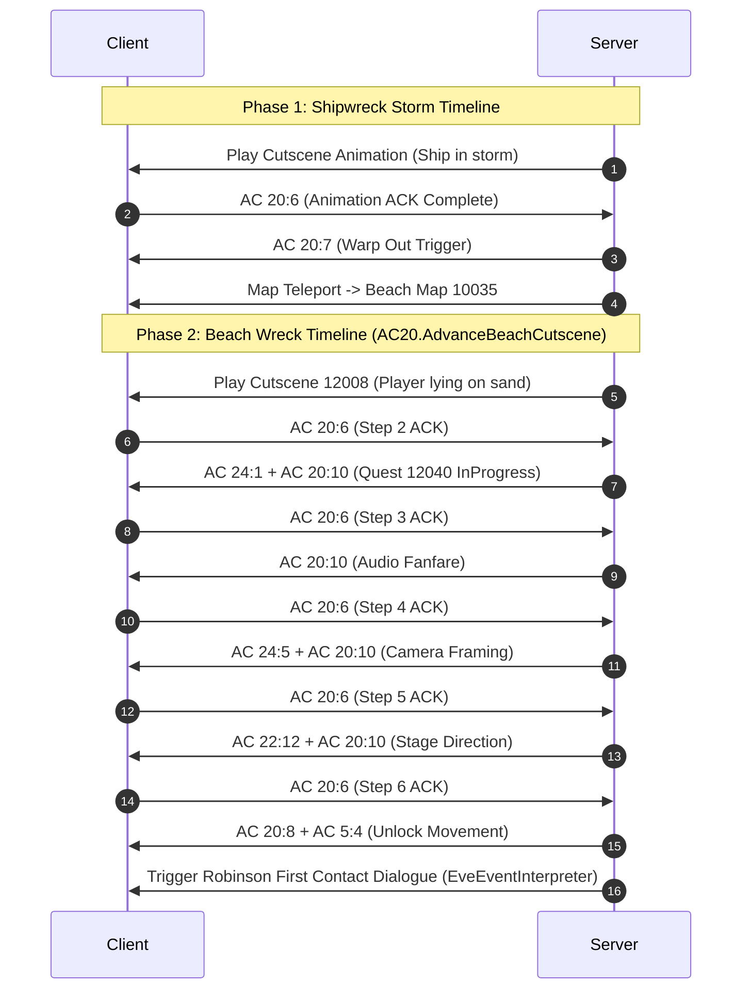

# Dialogue, Quest State Machine, and Cinematic Cutscene Engine

## 1. Architectural Overview

The narrative simulation in Wonderland Online integrates three tightly coupled systems:
1. **Dialogue Engine (`Talk.dat` + `AC 20:1` / `AC 20:9`):** Manages modal NPC conversation boxes, 24-bit talk IDs, text variable injection, and player choice branching.
2. **Quest State Machine (`character_quests` + `QuestManager`):** Tracks multi-step quest progression, prevents state demotion, and resolves branching outcomes.
3. **Pre-Event Condition Interpreter (`PreEventInterpreter`):** Evaluates `eve.Emg` condition bytecodes to dynamically show or hide stage props, NPCs, and companions on a per-player basis.
4. **Cinematic Cutscene Sequencer (`AC 20` Timeline):** Coordinates synchronized camera pans, animations, audio fanfares, and client ACK handshakes.

---

## 2. Dialogue & Conversation Architecture

### 2.1 Packet Dispatch & Flow Control
* **Click Trigger (`AC 20:1`):** Client sends the clicked NPC entity ID (`clickId`).
* **Dialogue Frame (`AC 20:1` Server -> Client):** The server issues `Tools.FromFormat("bbw...", 20, 1, talkId)`.
* **Step Confirmation ACK (`AC 20:6` Client -> Server):** Fired when the player presses Enter or clicks through a dialogue frame. The server invokes `Player.ContinueInteraction()`.
* **Choice Selection (`AC 20:9` Client -> Server):** Fired when the player selects a branch (Choice `1`, `2`, etc.). Handled in [`AC20.Recv9`](file:///D:/GitHub/Wonderland-Private-Server/Src/Network/ActionCodes/AC20.cs#L269) via `player.OnDialogueChoice` delegate callback.
* **Mobility Lock & Unlock (`AC 20:8` / `AC 5:4`):** When dialogue initiates, player input is locked via `AC 20:8`. Upon dialogue termination, `AC 20:8` (unfreeze) followed by `AC 5:4` (restore walking speed) is dispatched.

---

## 3. Quest State Machine & Flag Model

Quest progression is persisted in the [`character_quests`](file:///D:/GitHub/Wonderland-Private-Server/docs/02_database_schema_and_persistence.md#36-character_quests) table and managed in-memory via `Dictionary<uint, PlayerQuest>`.

### 3.1 Lifecycle States (`QuestState`)
```csharp
public enum QuestState : ushort
{
    NotStarted = 2,
    InProgress = 1,
    Completed  = 3
}
```

### 3.2 State Transition & Demotion Prevention
To prevent narrative regression or duplicate rewards:
* **State Monotonicity:** A quest in state `Completed` (`3`) can never be overwritten by `InProgress` (`1`) or `NotStarted` (`2`).
* **Completion Flags:** When a quest finishes, official WLO sets the base `questId` to `Completed` (`3`) and frequently sets the adjacent flag `questId + 1` to `1` (marking downstream dialogue locks).
* **Multi-Event Resolution:** When an NPC registers multiple event scripts in `eve.Emg`, [`EveEventInterpreter`](file:///D:/GitHub/Wonderland-Private-Server/wlo.pserver.core/Game/Maps/Code/EveEventInterpreter.cs#L50) scans all branches using `SelectMatchingBranch` to prioritize post-completion dialogues over starter dialogues.

---

## 4. Pre-Event Interpreter & Visibility Engine

The [`PreEventInterpreter`](file:///D:/GitHub/Wonderland-Private-Server/wlo.pserver.core/Game/QuestRelated/PreEventInterpreter.cs#L13) decodes and evaluates the official 21-byte condition buffers found in `eve.Emg` PreEvents across all 1,119 maps.

### 4.1 7-Byte Condition Chunk Binary Specification
Condition buffers consist of up to three 7-byte chunks (total 21 bytes):

```
+---------------+---------------+-----------------------------------------------+
| Offset (Byte) | Type          | Description                                   |
+---------------+---------------+-----------------------------------------------+
| 0             | Byte          | Condition Opcode (0x01, 0x02, 0x03, 0x05)     |
| 1..2          | UInt16        | Identifier (FlagID, CompanionID, ItemID)      |
| 3..4          | UInt16        | Required Value (Required State, Count)        |
| 5..6          | UInt16        | Comparison Operator (1: ==, 2: >=, 3: <=, 4: !=) |
+---------------+---------------+-----------------------------------------------+
```

#### Supported Condition Opcodes
* **`0x01` (Unconditional):** Always evaluates to `true`.
* **`0x02` (Companion / Pet Recruitment Check):** Evaluates if target `petId` is present in active party, pet roster, or has recruited flag set.
* **`0x03` (Quest Step / Item Check):**
  * At Chunk 7 (offset 7) with active quest flag: Matches required quest `step` via operator `compType`.
  * At Chunk 0 (offset 0) with `itemId >= 10000`: Verifies character holds required count of items in inventory.
* **`0x05` (Quest Flag / Step Check):** 
  * Chunk 0 (offset 0): Matches `flagId` against `reqState` using `compType` (`1: InProgress`, `2: NotStarted`, `3: Completed`).
  * Chunk 7 (offset 7): Matches quest `step` requirement for active quests.

### 4.2 Action Chunk Binary Specification
Action buffers in `subentry2` control entity visibility and animation frames:

```
+---------------+---------------+-----------------------------------------------+
| Offset (Byte) | Type          | Description                                   |
+---------------+---------------+-----------------------------------------------+
| 0             | Byte          | Action Opcode (0x02: Actor/Prop Control)      |
| 1..2          | UInt16        | Target ClickID                                |
| 3..4          | UInt16        | Action Type (2: Hide/Despawn, 3: Show/Spawn,  |
|               |               |              5: Prop State Animation)         |
| 5..6          | UInt16        | Subtype / State parameter                     |
| 7             | Byte          | Padding (0x00)                                |
| 8..9          | Byte[2]       | Frame Marker (0xFF, 0xFF = Concealment Frame) |
+---------------+---------------+-----------------------------------------------+
```

* **ActionType `2` (Conceal / Despawn):** Dispatches authentic `AC 22:4` concealment frame (`[ClickID, 0xFFFF, X, Y, Type=2, Duration=0x03E7FC18, Stance=0]`), invoking client `FUN_00432674` to set `*(actor + 0x1eec) = 2`, clear grid collision via `FUN_0043d390`, and tracking the hidden entity in `player.HiddenNpcClickIDs`.
* **ActionType `3` (Reveal / Spawn):** Dispatches authentic `AC 22:4` spawn frame (`[ClickID, 0x00FF, X, Y, Type=1, Duration=0, Stance=0]`), setting `*(actor + 0x1eec) = 1` (visible) and clearing it from `player.HiddenNpcClickIDs`.
* **ActionType `5` (Prop State Animation):** Dispatches `AC 22:4` with custom state values (e.g., opened chest `0x0001` or broken gathering node).

### 4.3 Staged Quest Actor Isolation & Multi-Step Spawning
The visibility engine enforces per-player isolation for narrative consistency:
* **Recruited Companions:** Recruited companions (e.g., Robinson on Map 11016, Roca in Kelan Village Map 12000) are automatically suppressed on overworld maps via `AC 22:4` concealment frames (`Duration = 0x03E7FC18`).
* **Staged Cutscene Actors:** On Map 12000, mourning Roca at the grave (ClickID 34 & 36) is visible only during Quest 13052 ("Death of Roca's Father"), while standard Roca (ClickID 32) is hidden once recruited.
* **Quest Props:** Father's Statue (ClickID 33) and Iron Sword (ClickID 35) remain hidden until Quest 13098 ("Remembering Father") begins.
* **Lost Dog Quest:** Shiba Inu (ClickID 20) is only visible on the hills during Quest 13046 Step 1. Sitting dog (ClickID 28) returns to Lina's side only upon quest completion.
* **Declarative QuestDefinition Spawning:** Registered quests define `SpawnNpcClickIDs` and `DespawnNpcClickIDs` at both quest-level and step-level ([`QuestDefinition`](file:///D:/GitHub/Wonderland-Private-Server/wlo.pserver.core/Game/QuestRelated/QuestDefinition.cs)). Actors in `SpawnNpcClickIDs` are kept concealed until the prerequisite quest or step condition is satisfied.
* **Runtime Dynamic Synchronization:** [`QuestManager.SyncPerPlayerNpcVisibility`](file:///D:/GitHub/Wonderland-Private-Server/wlo.pserver.core/Game/QuestRelated/QuestManager.cs) hooks directly into `AcceptQuest`, `AdvanceQuestStep`, `SetPlayerQuestState`, `CompleteQuest`, `ResetQuest`, and `EveEventInterpreter` opcodes (2, 3, 5, battle victory) to trigger immediate, diff-checked visibility updates without requiring a map transition.

### 4.4 Full-Scale Eve.emg Map & Event Extraction Architecture
The official `eve.Emg` asset binary (5.16 MB) defines the complete global event ecosystem for the game:
* **Total Maps:** 1,119 scene entries.
* **Total Event Scripts:** 10,644 events across all maps.
* **Total PreEvent Descriptors:** 1,412 PreEvents with 6,018 condition chunks and 8,951 action chunks.
* **Total Native NPCs:** 8,181 entities with waypoint schedules.
* **Total Portal Warps:** 2,791 bidirectional warp coordinates.

[`EveManager.Load_ScenceData`](file:///D:/GitHub/Wonderland-Private-Server/wlo.pserver.core/DataFiles/EveLoader.cs) extracts 11 category offsets (`(dataptr + datalen) - 44` bytes) across all 1,119 maps without early loop termination, ensuring that high-index maps (such as 12544..60015) receive full event tables and PreEvent bytecode.

### 4.5 Multi-Candidate Event Resolution & Priority Hierarchy
In the Wonderland Online `Eve.emg` binary, NPC definitions in `Npclist` explicitly specify their event bindings via the `npcEntry.Events` array (e.g. Map 12000 Villager ClickID 4 binds to Event 12, Mary Lou ClickID 5 binds to Events [9, 10]). Over 5,617 native NPCs have assigned Event IDs that differ from their spatial `clickId`.

In [`EveEventInterpreter.TryExecute`](file:///D:/GitHub/Wonderland-Private-Server/wlo.pserver.core/Game/Maps/Code/EveEventInterpreter.cs):
1. **Linked Event Priority:** If an NPC contains entries in `npcEntry.Events`, those events are populated as primary candidates in their defined order (quest event first, idle dialogue second).
2. **ClickID Fallback:** The direct event match (`event.clickID == clickId`) is only used as a fallback if the entity has no explicit linked events (e.g., chests, gather nodes, interactive props).
3. **Dialogue Branch Validation:** Fallback branch selection validates that candidate branches contain genuine dialogue opcodes (`(DialogPtr == 1 && d1 == 2 && d2 >= 10000)`, `(DialogPtr == 2 && (d3 >= 10000 || d2 == 6))`, or choice opcodes `DialogPtr == 4 / 6`). Non-dialogue opcodes (such as Warp trigger `DialogPtr == 1, d1 == 3`) are strictly excluded from dialogue candidate pools.
4. **State Cascade Safety:** `SelectMatchingBranch` enforces `excludeSub` across all branch selectors, preventing recursive infinite loops when advancing post-condition quest states.

### 4.6 Zero-Op Item Gate Priority Pattern
In `eve.Emg` event bytecode, a **zero-op item condition sub** (`b1=2`, `SubEntry.Count == 0`) acts as a prerequisite gate for the **next executable sub** (found by `GetExecutableBranch` walking forward). This pattern appears across 22,171 zero-op subs globally.

**Compound Condition Chain Example (Map 12004, Event 2 -- Honeycomb Quest):**
```
Sub 2: b1=5, Quest 13022 InProgress, step=1     -- 3 ops  ("I need Honeycomb" dialogue)
Sub 4: b1=2, Item #30034 (Honeycomb), reqHave=T -- 0 ops  (ITEM GATE)
Sub 5: b1=5, Quest 13022 InProgress, step=1     -- 17 ops (quest completion branch)
```

Without item-gate priority, the main condition loop matches Sub 2 (quest state) first and returns it immediately, never reaching the item gate at Sub 4. The fix adds a dedicated priority pass **before** the main condition loop:

1. Scan all subs for zero-op `b1=2` item conditions.
2. If the item condition is satisfied, resolve the gated executable sub via `GetExecutableBranch`.
3. Verify the gated sub's own quest condition (if `b1=5`) matches the player's quest state.
4. Skip if the associated quest is already completed or contains completed quest ops.
5. Return the gated sub, overriding any earlier quest-state-only match.

This ensures that **item-gated completion branches take priority** over their unqualified quest-state counterparts when the player possesses the required item.

---

## 5. Cinematic Cutscene Sequencer

The server coordinates cinematic animations using packet timelines synchronized with client acknowledgments:



### 5.1 Failsafe Timeout Recovery
If client network lag or dropped packets prevent an `AC 20:6` ACK from reaching the server during an active cutscene, the server's background watchdog triggers a forced advance (`forceComplete = true`), cleanly releasing player movement locks and ensuring the player is never trapped in a frozen state.
