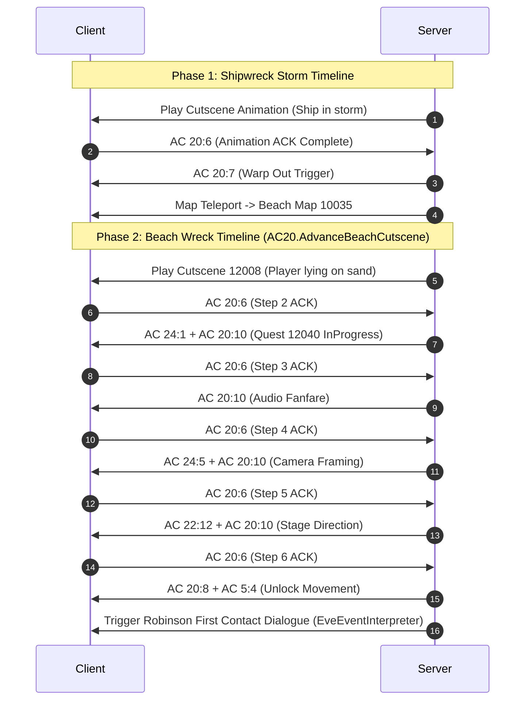

# Dialogue, Quest State Machine, and Cinematic Cutscene Engine

## 1. Architectural Overview

The narrative simulation in Wonderland Online integrates three tightly coupled systems:
1. **Dialogue Engine (`Talk.dat` + `AC 20:1` / `AC 20:9`):** Manages modal NPC conversation boxes, 24-bit talk IDs, text variable injection, and player choice branching.
2. **Quest State Machine (`character_quests` + `QuestManager`):** Tracks multi-step quest progression, prevents state demotion, and resolves branching outcomes.
3. **Pre-Event Condition Interpreter (`PreEventInterpreter`):** Evaluates `eve.Emg` condition bytecodes to dynamically show or hide stage props, NPCs, and companions on a per-player basis.
4. **Cinematic Cutscene Sequencer (`AC 20` Timeline):** Coordinates synchronized camera pans, animations, audio fanfares, and client ACK handshakes.

---

## 2. Dialogue & Conversation Architecture

### 2.1 Packet Dispatch & Flow Control
* **Click Trigger (`AC 20:1`):** Client sends the clicked NPC entity ID (`clickId`).
* **Dialogue Frame (`AC 20:1` Server -> Client):** The server issues `Tools.FromFormat("bbw...", 20, 1, talkId)`.
* **Step Confirmation ACK (`AC 20:6` Client -> Server):** Fired when the player presses Enter or clicks through a dialogue frame. The server invokes `Player.ContinueInteraction()`.
* **Choice Selection (`AC 20:9` Client -> Server):** Fired when the player selects a branch (Choice `1`, `2`, etc.). Handled in [`AC20.Recv9`](file:///D:/GitHub/Wonderland-Private-Server/Src/Network/ActionCodes/AC20.cs#L269) via `player.OnDialogueChoice` delegate callback.
* **Mobility Lock & Unlock (`AC 20:8` / `AC 5:4`):** When dialogue initiates, player input is locked via `AC 20:8`. Upon dialogue termination, `AC 20:8` (unfreeze) followed by `AC 5:4` (restore walking speed) is dispatched.

---

## 3. Quest State Machine & Flag Model

Quest progression is persisted in the [`character_quests`](file:///D:/GitHub/Wonderland-Private-Server/docs/02_database_schema_and_persistence.md#36-character_quests) table and managed in-memory via `Dictionary<uint, PlayerQuest>`.

### 3.1 Lifecycle States (`QuestState`)
```csharp
public enum QuestState : ushort
{
    NotStarted = 2,
    InProgress = 1,
    Completed  = 3
}
```

### 3.2 State Transition & Demotion Prevention
To prevent narrative regression or duplicate rewards:
* **State Monotonicity:** A quest in state `Completed` (`3`) can never be overwritten by `InProgress` (`1`) or `NotStarted` (`2`).
* **Completion Flags:** When a quest finishes, official WLO sets the base `questId` to `Completed` (`3`) and frequently sets the adjacent flag `questId + 1` to `1` (marking downstream dialogue locks).
* **Multi-Event Resolution:** When an NPC registers multiple event scripts in `eve.Emg`, [`EveEventInterpreter`](file:///D:/GitHub/Wonderland-Private-Server/wlo.pserver.core/Game/Maps/Code/EveEventInterpreter.cs#L50) scans all branches using `SelectMatchingBranch` to prioritize post-completion dialogues over starter dialogues.

---

## 4. Pre-Event Interpreter & Visibility Engine

The [`PreEventInterpreter`](file:///D:/GitHub/Wonderland-Private-Server/wlo.pserver.core/Game/QuestRelated/PreEventInterpreter.cs#L13) decodes and evaluates the official 21-byte condition buffers found in `eve.Emg` PreEvents across all 1,119 maps.

### 4.1 7-Byte Condition Chunk Binary Specification
Condition buffers consist of up to three 7-byte chunks (total 21 bytes):

```
+---------------+---------------+-----------------------------------------------+
| Offset (Byte) | Type          | Description                                   |
+---------------+---------------+-----------------------------------------------+
| 0             | Byte          | Condition Opcode (0x01, 0x02, 0x03, 0x05)     |
| 1..2          | UInt16        | Identifier (FlagID, CompanionID, ItemID)      |
| 3..4          | UInt16        | Required Value (Required State, Count)        |
| 5..6          | UInt16        | Comparison Operator (1: ==, 2: >=, 3: <=, 4: !=) |
+---------------+---------------+-----------------------------------------------+
```

#### Supported Condition Opcodes
* **`0x01` (Unconditional):** Always evaluates to `true`.
* **`0x02` (Companion / Pet Recruitment Check):** Evaluates if target `petId` is present in active party, pet roster, or has recruited flag set.
* **`0x03` (Inventory Item Possession):** Verifies if the character holds `>= count` of `itemId`.
* **`0x05` (Quest Flag / Step Check):** 
  * Chunk 0: Matches `flagId` against `reqState` using `compType`.
  * Chunk 7: Matches quest `step` requirement for active quests.

### 4.2 Staged Quest Actor Isolation
The visibility engine enforces per-player isolation for narrative consistency:
* **Recruited Companions:** Recruited companions (e.g., Robinson on Map 11016, Roca in Kelan Village Map 12000) are automatically suppressed on overworld maps via `AC 22:10` and `AC 22:11`.
* **Staged Cutscene Actors:** On Map 12000, mourning Roca at the grave (ClickID 34 & 36) is visible only during Quest 13052 ("Death of Roca's Father"), while standard Roca (ClickID 32) is hidden once recruited.
* **Quest Props:** Father's Statue (ClickID 33) and Iron Sword (ClickID 35) remain hidden until Quest 13098 ("Remembering Father") begins.
* **Lost Dog Quest:** Shiba Inu (ClickID 20) is only visible on the hills during Quest 13046 Step 1. Sitting dog (ClickID 28) returns to Lina's side only upon quest completion.

---

## 5. Cinematic Cutscene Sequencer

The server coordinates cinematic animations using packet timelines synchronized with client acknowledgments:



### 5.1 Failsafe Timeout Recovery
If client network lag or dropped packets prevent an `AC 20:6` ACK from reaching the server during an active cutscene, the server's background watchdog triggers a forced advance (`forceComplete = true`), cleanly releasing player movement locks and ensuring the player is never trapped in a frozen state.
