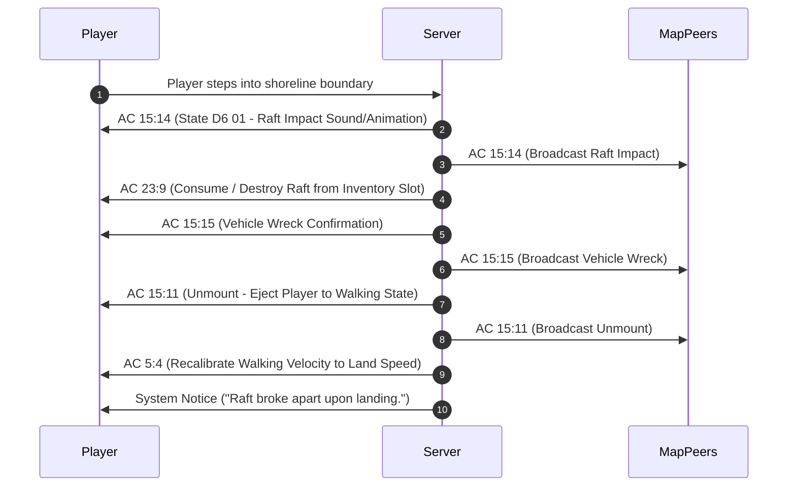

# Gameplay Subsystems and Core Mechanics

## 1. Inventory and Item Management Subsystem

The inventory management engine provides deterministic slot-based storage across inventory bags, equipment slots, tent containers, and ground terrain.

### 1.1 Bag Layout & 31-Byte Record Specification (`AC 23:5`)
Players possess a base 50-slot inventory bag. The inventory layout is serialized into an array of 31-byte binary records sent via [`AC 23:5`](file:///D:/GitHub/Wonderland-Private-Server/docs/03_network_protocol_and_action_codes.md#43-inventory--ground-item-protocol-ac-23):

```
+---------------+---------------+---------------------------------------+
| Offset (Byte) | Type          | Description                           |
+---------------+---------------+---------------------------------------+
| 0             | Byte          | Bag Slot Index (1..50)                |
| 1..2          | UInt16        | Item ID (from Item.dat)               |
| 3             | Byte          | Item Quantity / Stack Count           |
| 4..5          | UInt16        | Current Durability                    |
| 6..7          | UInt16        | Maximum Durability                    |
| 8             | Byte          | Unlocked Socket Count (0..3)          |
| 9..10         | UInt16        | Socket 1 Gem ID                       |
| 11..12        | UInt16        | Socket 2 Gem ID                       |
| 13..14        | UInt16        | Socket 3 Gem ID                       |
| 15            | Byte          | Enhancement / Forge Level (+0..+12)   |
| 16..30        | Byte[15]      | Extended attributes and padding       |
+---------------+---------------+---------------------------------------+
```

### 1.2 Equipment Serialization (`AC 23:11`)
Equipment is equipped across 6 canonical body slots:
1. `Head` (Helmets, hats, circlets)
2. `Body` (Armor, robes, coats)
3. `Right Hand` (Weapons, wands, bows)
4. `Left Hand` (Shields, sub-weapons)
5. `Wrist` (Bracers, gloves)
6. `Foot` (Boots, shoes)

### 1.3 Starter Pack Fallback Engine (`StarterPackManager`)
To safeguard new characters created during network desyncs or external registration, [`StarterPackManager`](file:///D:/GitHub/Wonderland-Private-Server/wlo.pserver.core/Game/PlayerRelated/StarterPackManager.cs) inspects character level upon login:
* If `Level <= 1` and no starter items are detected, it automatically delivers essential survival gear (wooden weapons, beginner armor, bread, and healing potions) before dispatching `AC 23:5`.

---

## 2. Companions, Pets, and Mounts Subsystem

Companions represent recruited human storyline allies (Robinson, Roca, Clive, Niss, S. Monkey, etc.) and wild captured animals/beasts.

### 2.1 Recruitment & Overworld Despawning
* **Recruitment:** Triggered via script bytecode (`EveEventInterpreter`). The entity is added to the player's active party and persisted to the `character_pets` database table. Server transmits initial companion stats via `AC 15:1` and activates battle mode via `AC 19:1`.
* **Overworld Despawn Isolation:** To prevent clone duplicates, once an NPC is recruited, [`Map.SendMapInfo`](file:///D:/GitHub/Wonderland-Private-Server/wlo.pserver.core/Game/Maps/Map.cs#L1407) emits dual concealment packets `AC 22:10` and `AC 22:11` to suppress that NPC for that specific player.

### 2.2 Login Synchronization & Overworld Follower
* **Login Pet Sync:** During character login in [`WorldServer.CommenceLogin`](file:///D:/GitHub/Wonderland-Private-Server/Src/Server/WorldServer.cs), all companions stored in `character_pets` are transmitted to the client via `AC 15:1` along with learned skill trees via `QuestManager.SendPetSkills`. If an active battle pet is designated, `AC 19:4` and `AC 19:1` are sent.
* **Map Follower (`AC 15:4`):** When warping or toggling battle mode, an authentic `AC 15:4` packet `[CharID: 4B, PetID: 4B, 0, 1, Name: String, EquipTail: 8B]` is dispatched to the player and broadcast to map peers.
* **Standby Mode (`AC 19:7` & `AC 19:2`):** Resting a companion emits `AC 19:7 [CharID: 4B]` to despawn the follower sprite from the overworld, followed by `AC 19:2` to confirm standby stance.
* **Riding & Dismounting:** Riding a pet transmits `AC 15:11`, eliciting `AC 15:16 [Slot, CharID, PetID, 26 zeros]`. Dismounting emits `AC 15:12`, eliciting `AC 15:17 [CharID]` and restoring the follower sprite if the pet was active in battle.

### 2.3 Battle Spawn & Matrix Positioning (`AC 11:5`)
* **Friendly Pets:** Spawned with side indicator `0x05` and type `0x04`, providing slot index, owner `CharID`, HP/SP, and accurate element and level.
* **Element & Level Ordering:** Byte 26 contains element (`0=Earth, 1=Water, 2=Fire, 3=Wind`) and Byte 27 contains level, matching official network packet captures.

### 2.4 Amity (Loyalty / Intimacy)
* Values range from `0` to `100`.
* Default starting amity for recruited human companions is `60`.
* **Death Penalty:** If a companion faints in battle, amity decreases by `1..5` points.
* **Abandonment Threshold:** If companion amity drops below `20`, the companion may refuse battle orders or permanently leave the player's party.
* **Combat Stance:** Managed via `AC 19`, controlling whether the companion fights (`Battle`), defends (`Guard`), or rides along (`Standby`).

### 2.5 Pet Hotel & Storage Farm (`AC 31`)
Players can store up to 10 inactive pets in the pet hotel/farm without consuming active bag or party slots.

### 2.6 Companion Combat Skills & Real-time State Synchronization
* **Skill Unlock Protocol (`AC 8:2` Stat 367):** Pet skills are synchronized upon login ([`SkillManager.SendAllSkills`](file:///D:/GitHub/Wonderland-Private-Server/wlo.pserver.core/Game/SkillRelated/SkillManager.cs#L784)), battle initiation ([`PvEBattleManager`](file:///D:/GitHub/Wonderland-Private-Server/wlo.pserver.core/Game/Battle/PvEBattleManager.cs#L1111)), recruitment, and battle companion switching. Wire format is `[8, 2, TargetType=4, Slot: 2B, StatID=0x016F: 2B, Grade/Exp=1: 4B, SkillID: 4B]`. TargetType `0x04` is mandatory; passing player target codes or slot in byte 0 causes the client to drop the pet skill registration.
* **Skill Catalog Resolution:** Companion skills are resolved by [`QuestManager.GetDefaultPetSkills`](file:///D:/GitHub/Wonderland-Private-Server/wlo.pserver.core/Game/QuestRelated/QuestManager.cs#L1152) combining curated human companion ability sets (Robinson's *Fury Strike* / *Freeze Strike*, Roca's *Heart Chop* / *Earthquake Chop*, Niss's *Icicle Attack*, Fred's *Fire Wave*, etc.) and dynamic `Npc.dat` lookups (`SkillID1`, `SkillID2`, `SkillID3`) for wild and generic captured creatures.
* **In-Battle Action Consumption & Feedback:** When a pet casts an offensive or support skill (`AC 50:1`), SP is deducted server-side and immediately synchronized to the owner's status interface via `AC 8:2` (Stat `0x011A`, SP value). Skill proficiency EXP is awarded via `AC 8:2` (Stat `0x016F`).
* **Damage & Recovery Synchronization:** When a companion takes damage or receives healing/revival, the server updates `PetRef.HP` and sends `AC 8:2` (Stat `0x0119`, HP value) directly to the owner in addition to battlefield grid broadcast `AC 51:1`.
* **Level-Up Stat Reflection:** When victorious battle EXP triggers a pet level increase, the server synchronizes new Level (Stat `0x011D`), MaxHP (Stat `0x0119`), and MaxSP (Stat `0x011A`) via authentic `AC 8:2` packets.

---


## 3. Vehicles and Marine Transport Engine

The vehicle system ([`VehicleManager`](file:///D:/GitHub/Wonderland-Private-Server/wlo.pserver.core/Game/PlayerRelated/Vehicle.cs#L43)) provides land, water, and air locomotion.

### 3.1 Vehicle Classifications
1. **Water Vehicles:** Wooden Raft (`36001`), Canoe (`36002`), Sailboat (`36003`), Steamboat (`36004`), Submarine (`36005`).
2. **Air Vehicles:** Hot Air Balloon (`36006`), Airship (`36007`), UFO (`36008`).
3. **Land Vehicles:** Bicycle (`36010`), Motorcycle (`36011`), Beetle Car (`36012`).

### 3.2 Raft Shore Shipwreck Handshake Sequence
When navigating a basic wooden raft onto shallow shores (such as South Island or Kelan Beach), official mechanics dictate raft destruction:



---

## 4. Tent Housing and Personal Interior (`AC 12` / `AC 65`)

The Tent is a portable player house deployable across outdoor non-combat zones.

* **Deployment (`AC 65:1`):** Player double-clicks the tent item (Item ID `36002`). Server validates terrain pathing, reserves an instance coordinate, and broadcasts tent deployment `AC 65:1` to map peers.
* **Entrance Transition:** Interacting with an open tent teleports the character to interior coordinates `(X: 460, Y: 700)` inside the player's personal tent map instance.
* **Furniture & Storage (`AC 12` & `AC 30`):** Players can arrange crafting furniture (Alchemy Pot, Workbench, Loom) and storage chests. Container inventories are persisted in the database via `AC 30`.
* **Closing Tent (`AC 65:4`):** When the owner exits and packs up the tent, server broadcasts `AC 65:4` and removes the overworld tent entity.

---

## 5. Turn-Based Combat Engine & Elemental Wheel

Battles in Wonderland Online occur in discrete turn-based battle arenas ([`PvEBattleManager`](file:///D:/GitHub/Wonderland-Private-Server/wlo.pserver.core/Game/Battle/PvEBattleManager.cs) and [`Battle.cs`](file:///D:/GitHub/Wonderland-Private-Server/wlo.pserver.core/Game/Battle/Battle.cs)).

### 5.1 Grid Matrix & Team Layout
The battle arena is arranged in a 4x4 or 4x2 isometric combat grid:
* **Attacker Team (Right Side):** Backline characters positioned at `GridX = 4`, front-line companions/pets at `GridX = 3`.
* **Defender Team (Left Side):** Monsters and enemies positioned at `GridX = 1` and `GridX = 2`.

### 5.2 Turn-Order Initiative (Agility / SPD)
* Action sequence is determined by individual entity Agility (`SPD`).
* Entity with the highest `SPD` executes their action first.
* In team battles, combo attacks (`Combo`) trigger when multiple adjacent allies share high speed margins and target the same enemy entity.

### 5.3 Elemental Affinities & Multipliers
Wonderland Online features four classical elemental disciplines:

```
    Earth  ------->  Water
      ^                |
      |                |
      |                v
     Wind  <-------  Fire
```

* **Advantage (+50% Damage / `1.50x` Multiplier):**
  * **Earth** overcomes **Water**
  * **Water** overcomes **Fire**
  * **Fire** overcomes **Wind**
  * **Wind** overcomes **Earth**
* **Disadvantage (-35% Damage / `0.65x` Multiplier):**
  * Attacking an opposing element with tactical disadvantage incurs reduced damage and higher miss chances.

### 5.4 Combat Status Effects (`FighterStatusType`)
* `Frozen` / `Ice Seal`: Target cannot act for `N` turns.
* `Sleep`: Target incapacitated until attacked.
* `Sealed` / `Tree Bind`: Magic and attack capabilities immobilized.
* `Confused` / `Mess`: Target strikes random allies or enemies.
* `Poisoned`: Inflicts proportional HP loss at the start of each round.
* `Shielded` / `Earth Barrier`: Absorbs 50% to 100% of incoming physical damage.
* `HotBlooded`: Grants a `2.0x` damage amplification buff to physical attacks.

### 5.5 Combat Packet Protocol & Wire Synchronization
* **Map Presence Broadcast (`AC 11:4`):** When entering combat, the server emits `AC 11:4 [0x02, CharID, 0, 0, 1]` to map peers to display the crossed-swords combat indicator. On combat completion, `AC 11:4 [0x02, CharID, 0, 0, 0]` is broadcast to clear the indicator.
* **Turn Prompting & Acknowledgment (`AC 52:1` & `AC 53:5`):** Action UI input is enabled via `AC 52:1` without premature `AC 50:6`. When an action command (`AC 50:1`) is received, the server responds with `AC 53:5 [srcGridX, srcGridY]`, signaling the client to advance focus automatically to pet/companion actions.
* **Turn Replay Markers (`AC 50:6`):** `AC 50:6 [GridX, GridY, 0]` is dispatched immediately before each fighter's `AC 50:1` animation record to focus the active actor.
* **In-Combat Knockout (`AC 53:3`):** When any combat entity reaches 0 HP, `AC 53:3 [GridX, GridY]` is dispatched to trigger the knockout animation. The server strictly refrains from emitting `AC 11:1` during active combat rounds to avoid premature sprite despawning.
* **Stat Commit (`AC 51:1`):** Dynamic HP (`0x19`) and SP (`0x1A`) changes are committed via `AC 51:1 [GridX, GridY, StatType, Value: UInt32]`.
* **Battle Exit Despawn Sequencing (`AC 11:12`, `AC 11:1`, `AC 11:0`):** Combat closes with `AC 11:12 [1]` (victory/defeat), followed by 4-byte `AC 11:1 [GridX, GridY]` for pets, 6-byte `AC 11:0 [CharID, 0, 0]`, and 5-byte `AC 11:1 [GridX, GridY, 0]` for players, cleanly releasing map mobility without spurious map-mode override packets.

---

## 6. Social, Guild, and Economic Systems

### 6.1 Mutual Friend Presence & Roster Synchronization (`AC 14` & `AC 10`)
* The social engine delegates online state checks to [`Friendlist.IsPlayerOnlineHandler`](file:///D:/GitHub/Wonderland-Private-Server/Src/Server/WorldServer.cs#L59) and persists relationships in the `Friends` table (`CharID1`, `CharID2`).
* **Login Synchronization:** Dispatches `AC 14:11` (tab categorization, 26 bytes/friend) and `AC 14:5` (main roster, 28 bytes/friend) upon map entry.
* **Friend Request & Mutual Acceptance:** Dispatches forward request `AC 14:2`, reciprocal acceptance `AC 14:3`, confirmation ACK `AC 14:9`, and dual online presence updates via `AC 14:7` and `AC 10:3 [CharID, 0xFF]`.
* **Friend Removal Synchronization:** When a friend is removed, reciprocal `AC 14:4 <targetCharID>` packets are dispatched to both players to immediately purge the friend sprite and entry from the client UI tree.

### 6.2 Player Trade (`AC 13`)
* **Phase 1 (Request):** Player A invites Player B (`AC 13:1`).
* **Phase 2 (Staging):** Both players insert items and gold into trade slots (`AC 13:3`).
* **Phase 3 (Lock):** Both parties confirm and lock trade windows (`AC 13:4`).
* **Phase 4 (Commit):** Transaction executed inside an atomic SQLite transaction lock.

### 6.3 Guild System (`AC 91`)
* Supports guild founding, custom insignia uploads (`SendInsignia`), roster management, rank-based privilege delegations, and territorial guild war battlefields (`AC 184`).

### 6.4 Item Mall & Points (`AC 75` / `AC 35`)
* Communicates through the isolated Item Mall listener on TCP Port `6416`.
* Dispatches authentic catalog listings, promotional packages, point transactions, and inventory claims.
