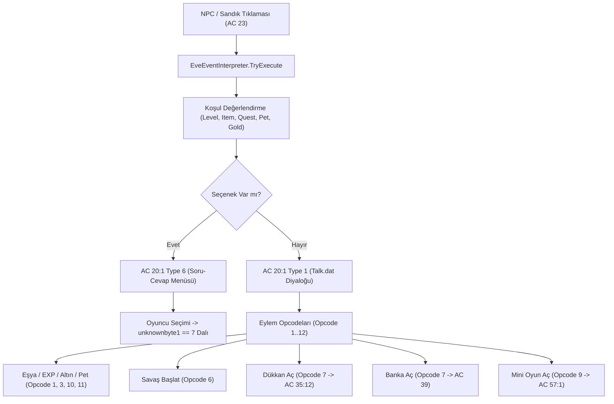

# Wonderland Online Olay Akış (Event Flow) Motoru & 5 Temel Arayüz Entegrasyonu

Wonderland Online istemci ve sunucu mimarisinde **tüm harita etkileşimleri ve görev olay akışı** `eve.Emg` dosyasındaki bytecode opcodelarının yorumlanmasıyla yürütülür. Aşağıdaki 5 temel olay türü sunucu tarafında eksiksiz olarak entegre edilmiştir:

---

## 1. Olay Akışındaki 5 Ana Arayüz ve Protokolleri

### 1.1 Tek Pencereli Konuşma Arayüzü (`AC 20:1 Type 1`)
* **Tetiklenme**: `eve.Emg` içerisindeki `Opcode 1` ve `Opcode 2` diyalog adımları.
* **Protokol**:
  - Paket: `AC 20 SubCode 1`
  - Tip: `0x01` (Diyalog)
  - Portre: `0x03` (NPC Portresi), `0x07` (Oyuncu Portresi)
  - TalkID: `Talk.dat` üzerindeki 24-bit little-endian metin indeksi.
* **Akış**: Çok adımlı diyaloglar `player.QueueData` kuyruğuna alınır. Oyuncu konuştukça istemci `AC 20:2` gönderir ve sunucu sonraki cümleyi basar.

---

### 1.2 Soru-Cevap Seçim Menüleri (`AC 20:1 Type 6`)
* **Tetiklenme**: `eve.Emg` içerisindeki `isChoiceOp` (`DialogPtr == 2 && dialog2 == 6`) adımı.
* **Protokol**:
  - Paket: `AC 20:1`
  - Tip: `0x06` (Seçenek Menüsü)
  - Seçenek Sayısı: `choiceCount` (2 ile 5 arası seçenek).
* **Dallanma**: Oyuncu bir seçeneğe tıkladığında istemciden `AC 20:3` (Seçim ID'si: `0x1E` veya `0x28` tabanlı) gelir. Sunucu bunu `unknownbyte1 == 7` olan hedef dala (`unknownword2 == 30 + branchIdx`) aktarır ve hikaye dallanarak devam eder.

---

### 1.3 Alışveriş / Dükkan Kataloğu Arayüzü (`AC 35:12`)
* **Tetiklenme**: `eve.Emg` içerisindeki `Opcode 7` (Sistem Eylemi: Kod `1` Silahçı, `2` Eşyacı, `3` Zırhçı).
* **Protokol**:
  - Paket: `AC 35 SubCode 12`
  - Katalog ID: `0x0001FB84` (Silahlar) / `0x0001FB85` (Eşyalar/Potlar) / `0x0001FB83` (Zırhlar).
* **Akış**: İstemci yerel `Item.dat` dosyasından eşyaların fiyatını, resmini ve açıklamasını okuyarak alışveriş penceresini açar.

---

### 1.4 Depo / Banka Kasası Arayüzü (`AC 39` & `Props Keeper`)
* **Tetiklenme**: `Opcode 7` (Sistem Eylemi: Kod `4` veya `9` Kasa/Banka).
* **Protokol**:
  - Paket: `AC 39`
  - Fonksiyon: `player.OpenPropsKeeper()`
* **Akış**: Oyuncunun tüm haritalarda paylaşılan ortak eşya kasası açılır; eşya yatırma/çekme işlemleri anlık senkronize edilir.

---

### 1.5 Görev Savaşları ve Mini-Oyun Arayüzleri (`AC 57:1` & `Opcode 6`)
* **Görev Savaşı (`Opcode 6`)**:
  - `PvEBattleManager.StartPvEBattle` fonksiyonunu tetikler; `Npc.dat` ve `eve.Emg` formasyonundan yaratık gruplarını sahneye dizer.
* **Mini-Oyunlar (`Opcode 9` / `AC 57:1`)**:
  - Köstebek Vurma (Whack-a-mole), Hedef Vurma, Odun Kırma gibi mini oyun motorunu başlatır.
  - Oyun kazanıldığında `OnMinigameWon` tetiklenerek görev kuponu (`Item #30002`) ve görev adımı ilerlemesi verilir.

---

## 2. Olay Akışı Yönetim Şeması

