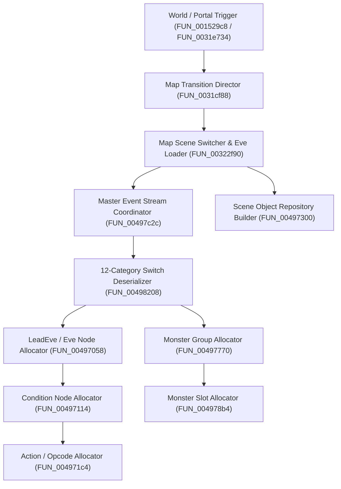

# Decompiled Engine: `Eve.emg` / `eve.dat` Event Engine Internals (`aLogin_decompiled.c`)

## 1. Overview
Reverse engineering analysis of `decompiled/aLogin_decompiled.c` and the C# server codebase reveals the complete call-graph and execution pipeline of the `Eve.emg` / `eve.dat` event engine across 4 distinct layers:
1. **Engine Stream & Memory Allocators** (Low-level node constructors)
2. **Category Deserializers** (12-category parser switch)
3. **Scene Lifecycle & Map Transition Directors** (High-level map loaders)
4. **Gameplay & Virtual Machine Interpreters** (Bytecode opcodes & server event dispatch)

---

## 2. Complete Call-Graph & Function Map

---

## 3. Client Subroutines in `aLogin_decompiled.c`

### 3.1 Scene Lifecycle & Map Transition Layer
* **`FUN_001529c8` (@ `0x001529c8`, Satır 152906)**: Harita geçiş tetikleyicisi (Portal/Warp event trigger).
* **`FUN_0031e734` (@ `0x0031e734`, Satır 308303)**: Sahne yenileyici ve harita nesnesi sıfırlayıcısı.
* **`FUN_0031cf88` (@ `0x0031cf88`, Satır 307273)**: Harita geçiş direktörü (Yeni haritanın blok, NPC, tuzak ve event verilerini başlatır).
* **`FUN_00322f90` (@ `0x00322f90`, Satır 310682)**: Ana Sahne & `Eve.EMG` dosya akış yöneticisi (`Open EveMrg` komutunu işletir).

### 3.2 Deserializer & Parser Layer
* **`FUN_00497c2c` (@ `0x00497c2c`, Satır 507369)**: 1'den 11'e kadar tüm kategorileri sırayla çağıran ana koordinatör.
* **`FUN_00498208` (@ `0x00498208`, Satır 507629)**: 12-durumlu ana switch ayrıştırıcısı:
  - `case 0`: `"Read SceneHead."` (Harita ID, Sahne ID, Izgara)
  - `case 1`: `"Read Block."` (2D Çarpışma / Engel Matrisi)
  - `case 2`: `"Read Point."` (Giriş/Çıkış Sınır Noktaları)
  - `case 3`: `"Read Npc."` (NPC Koordinat, Yön, Animasyon ve Rotalar)
  - `case 4`: `"Read Door."` (Işınlanma Kapıları / Warplar)
  - `case 5`: `"Read Mine."` (Maden, Odun, Balık Toplama Alanları)
  - `case 6`: `"Read Item."` (Sandıklar, Kasalar, Yer Eşyaları)
  - `case 7`: `"Read Trap."` (Tuzaklar ve Zemin Basamakları)
  - `case 8`: `"Read Eve."` (Görevler, Önkoşullar ve Sonuç Opcodeları)
  - `case 9`: `"Read Group."` (Harita Vahşi Canavar Grupları)
  - `case 10`: `"Read LeadEve."` (Sinematikler, Diyalog Ağaçları ve Pet Katılım Betikleri)
  - `case 11`: `"Read LeadGroup."` (Savaş Takviye Canavar Dalgaları)

### 3.3 Low-Level Memory Allocators & Node Constructors
* **`FUN_00497058` (@ `0x00497058`, Satır 506694)**: `Eve` ve `LeadEve` ana olay düğümü oluşturucusu (`PTR_PTR_00496958`).
* **`FUN_00497114` (@ `0x00497114`, Satır 506764)**: `Eve->Cdn` koşul değerlendirme düğümü oluşturucusu (`PTR_PTR_004968fc`).
* **`FUN_004971c4` (@ `0x004971c4`, Satır 506832)**: `Eve->Cdn->Result` eylem ve opcode düğümü oluşturucusu (`PTR_PTR_00496798`).
* **`FUN_00497770` (@ `0x00497770`, Satır 507111)**: Canavar grup düğümü tahsis edicisi (`PTR_DAT_00496c88`).
* **`FUN_004978b4` (@ `0x004978b4`, Satır 507170)**: Grup içi tekil canavar slot tahsis edicisi (`PTR_DAT_00496c30`).
* **`FUN_00497300` (@ `0x00497300`, Satır 506957)**: Sahne entity deposu oluşturucusu (`PTR_PTR_00496de0`).

---

## 4. Sunucu Tarafındaki Karşılıklar ([`EveLoader.cs`](file:///d:/GitHub/Wonderland-Private-Server/wlo.pserver.core/DataFiles/EveLoader.cs))
* **`EveManager.LoadFile` / `ReadData`**: İstemcideki `FUN_00322f90` ve `FUN_00497c2c`'ye karşılık gelir.
* **`Load_MapEntries`, `Load_ScenceData`, `Load_FinalData`**: İstemcideki `FUN_00498208` case 0..11 işlemlerini C# nesne grafiğine dönüştürür.
* **[`EveEventInterpreter.ExecuteEvent`](file:///d:/GitHub/Wonderland-Private-Server/wlo.pserver.core/Game/Maps/Code/EveEventInterpreter.cs)**: `Eve->Cdn->Result` içerisinde tanımlanan 16 farklı opcode'u (Diyalog, Eşya, Altın, Savaş, Pet, Warp, Kilit vb.) sunucu tarafında çalıştırır.
