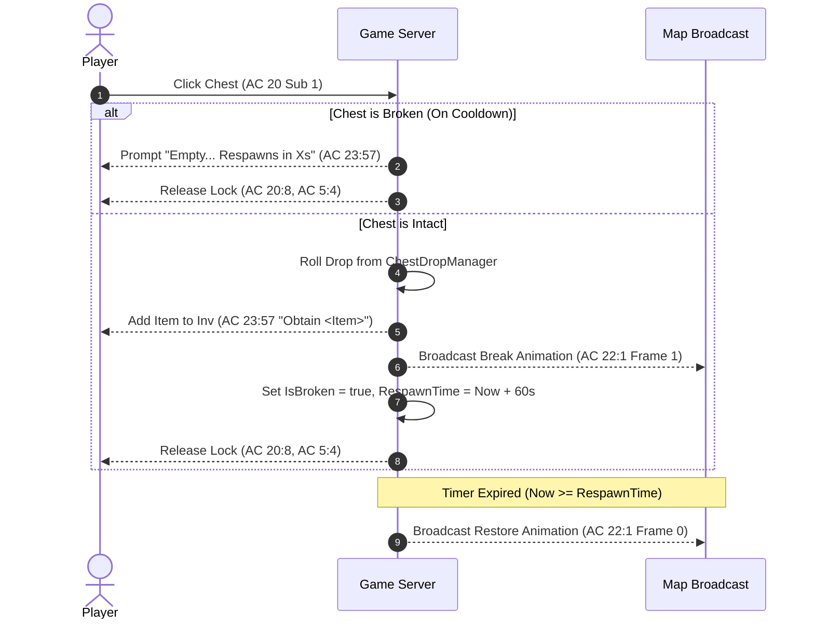

# Map Chest & Gathering Drop System

## 1. Overview
Implementation of the authentic map chest and gathering prop mechanics based on the decompiled client protocol and game architecture. When players interact with chests or props across different maps:
1. An item is rolled from a map/category-specific weighted loot table.
2. The item is awarded to the player's inventory with an authentic on-screen alert (`AC 23 Sub 57`).
3. The chest plays the breaking/opening animation frame (`AC 22 Sub 1`).
4. The chest enters a broken/cooldown state for a configurable duration (default 60 seconds).
5. Interacting with an empty chest informs the player of the remaining respawn cooldown.
6. Once the cooldown expires, the server broadcasts the intact restoration frame (`[22, 1, clickId, 0, 0]`) to all players on the map.

---

## 2. Architecture & Components

### 2.1 Loot Table Manager (`ChestDropManager.cs`)
* **File:** [`wlo.pserver.core/Game/Maps/ChestDropManager.cs`](file:///d:/GitHub/Wonderland-Private-Server/wlo.pserver.core/Game/Maps/ChestDropManager.cs)
* **Map-Specific Loot Pools:**
  * **Map 10036 (Shipwreck Beach / Robinson):** Coconut (41066), Fresh Fruit (28014), Sea Water (28001), Ordinary Wood (27001).
  * **Map 10001 (Kelan Woods / Forests):** Red Apple (28006), Mushroom (28012), Herb Potion (30001), Pine Wood (27002).
  * **Map 10010 (Kelan Village):** Black Medicine (30259), Cooking Salt (28003), White Rice (28015), Fresh Milk (28007).
  * **Map 10020 (Maka Cave / Underground Mines):** Iron Ore (24001), Copper Ore (24002), Coal (24005), Gold Sand (24010).

### 2.2 Entity State & Lifecycle (`QuestNpc.cs`)
* **File:** [`wlo.pserver.core/Game/Maps/Code/QuestNpc.cs`](file:///d:/GitHub/Wonderland-Private-Server/wlo.pserver.core/Game/Maps/Code/QuestNpc.cs)
* **Properties:**
  * `IsBroken` (bool): Tracks whether the chest is currently opened / depleted.
  * `RespawnTime` (DateTime): Expiration timestamp for the broken state.
* **Update Engine:**
  * Checks if `DateTime.Now >= RespawnTime` and resets `IsBroken = false`, broadcasting `[22, 1, clickId, 0, 0]` to the map.

---

## 3. Protocol Flow

