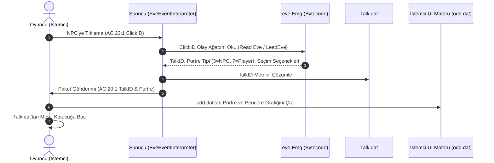

# NPC Arayüzleri ve İlgili `.dat` Dosyaları Mimarisi

Wonderland Online istemci ve sunucu mimarisinde NPC etkileşimleri, diyalog pencereleri ve arayüzler tek bir dosyadan değil, **5 ana veri dosyasının** ortaklaşa çalışmasıyla üretilir:

---

## 1. Veri Dosyaları ve Görev Dağılımı

| Dosya Adı | Dosya Yolu | İstemci / Sunucu Rolü | İçerdiği Arayüz / Veri |
| :--- | :--- | :--- | :--- |
| **`Talk.dat`** | `Data/Talk.dat` | **Metin Kaynağı** | Tüm NPC diyalogları, konuşma balonları, soru-cevap seçenekleri ve sistem mesajları (Toplam 13,763 diyalog). |
| **`eve.Emg`** | `Data/eve.Emg` | **Olay & Mantık Motoru** | Hangi NPC tıklandığında hangi arayüzün açılacağını (`AC 20:1`, `AC 35:12`, `AC 23`, `AC 57`), diyalog akışını ve seçim dallarını yöneten bytecode tablosu. |
| **`Npc.dat`** | `Data/Npc.dat` | **Karakter & Portre Şablonları** | 982 NPC ve yaratığın görsel sprite ID'leri, kafa/vücut modelleri, seviyeleri, elementleri ve temel özellikleri. |
| **`Mark.dat`** | `Data/Mark.dat` | **Görev Günlüğü Arayüzü (F6)** | 2,154 görevin başlıkları, özetleri, ipuçları ve aşama kayıtları. |
| **`odd.dat` / `odd_d01.dat`** | `Data/odd.dat` | **Grafik ve Pencereler (UI Sprites)** | İstemci tarafında diyalog kutusu çerçeveleri, NPC yüz portreleri (Portraits), butonlar ve seçim kutularının 2D grafik paketleri. |
| **`cuts.dat`** | `dat/cuts.dat` | **Sinematik ve Çizimler** | Hikaye sahnelerindeki tam ekran NPC çizimleri ve animasyonlu ara sahneler. |

---

## 2. NPC Tıklandığında Arayüz Nasıl Oluşur?

---

## 3. Arayüz Tipleri ve Protokol Paketleri

1. **Standart NPC Diyalog Penceresi**:
   - Protokol: `AC 20:1` (Type 1)
   - Portre: `odd.dat` içerisindeki NPC yüz çizimi (Portre ID `3` veya `7`).
   - Metin: `Talk.dat` üzerindeki 24-bit TalkID.

2. **Seçenekli Soru-Cevap Menüsü (Choice Prompt)**:
   - Protokol: `AC 20:1` (Type 6, Choice Count: 2..5)
   - Dallanma: `eve.Emg` üzerindeki `unknownbyte1 == 7` dalları.

3. **Tüccar Alışveriş Arayüzü (Shop Catalog)**:
   - Protokol: `AC 35:12` (Catalog ID `0x0001FB84` / `0x0001FB85`)
   - Eşyalar: `Item.dat` üzerinden fiyat ve açıklamalarla birlikte istemci penceresine listelenir.

4. **Kasa / Depo Arayüzü (Props Keeper)**:
   - Protokol: `AC 39` / Banka kasası arayüzü.
