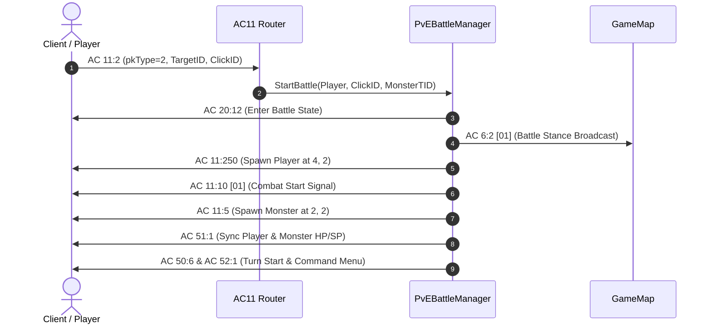

# PvE & Monster Turn-Based Battle System

## Overview
The PvE Battle System enables turn-based combat when engaging monsters or NPCs via the in-game PK tool / interaction. Ported from the authentic Python server implementation (`gameserver.py` `_start_pve_battle`, `handle_11_combat.py`, and `handle_50_battle.py`).

---

## Technical Specifications

### 1. Combat Initiation Protocol (`AC 11 Sub 2`)
- **Action Code**: `11`
- **Sub Action**: `2`
- **Packet Structure**: `[11, 2, <pk_type 1B>, <raw_target_id 4B>, <click_id 2B>]`
- **PK Type Routing**:
  - `pk_type == 2` (or `1`): PvE Monster Battle initiation. Resolves target monster definition and launches combat via `PvEBattleManager.StartBattle(attacker, click_id, target_id)`.
  - `pk_type == 3`: PvP Player Challenge. Checks if target is an active player on the same map.

### 2. Battle Sequence & Packet Lifecycle

### 3. Combat Turn & Animation Protocol (`AC 50 Sub 1` & `AC 53 Sub 5`)

#### A. Player Action Execution
1. **Action Trigger Notification**: `AC 53:5 [srcX, srcY]`
2. **Animation Block (`AC 50:1`)**:
   - `[50, 1, 0x11, 0x00, srcX, srcY, <skillId 2B>, 0, 1, dstX, dstY, 1, 0, 1, 0x19, <damage 4B>, 1]`
3. **Target HP Stat Sync**: `AC 51:1 [dstX, dstY, 0x19, <newHP 4B>]`
4. **Animation Delay**: `Task.Delay(1500)` to allow the client animation to play out.

#### B. Monster Counter-Attack
1. **Action Trigger Notification**: `AC 53:5 [monX, monY]`
2. **Animation Block (`AC 50:1`)**:
   - `[50, 1, 0x11, 0x00, monX, monY, 10001, 0, 1, playerX, playerY, 1, 0, 1, 0x19, <damage 4B>, 1]`
3. **Player HP Stat Sync**: `AC 51:1 [playerX, playerY, 0x19, <newHP 4B>]`
4. **Animation Delay**: `Task.Delay(1400)`

#### C. Battle Victory & Conclusion Protocol
1. `AC 51:1 [monX, monY, 0x19, 0]` (Sets monster HP to 0)
2. `await Task.Delay(1800)` (Allows monster death animation to finish)
3. `AC 11:12 [1]` (Combat finish signal)
4. `AC 22:6 [11, 0, 2]` (Battle Result Window: 2 = Victory)
5. `AC 22:5 [11 (2B), exp (2B), gold (2B)]` (Reward Popup)
6. `AC 11:0 [char_id (4B), 0 (2B)]` (Closes combat window and returns to overworld map)
7. `AC 11:1 [4, 2, 0]` (Despawns battle fighter entity)
8. `AC 20:8` (Releases client movement lock)

---

## Source Files

- [`wlo.pserver.core/Game/Battle/PvEBattleManager.cs`](file:///d:/GitHub/Wonderland-Private-Server/wlo.pserver.core/Game/Battle/PvEBattleManager.cs)
- [`Src/Network/ActionCodes/AC11.cs`](file:///d:/GitHub/Wonderland-Private-Server/Src/Network/ActionCodes/AC11.cs)
- [`Src/Network/ActionCodes/AC50.cs`](file:///d:/GitHub/Wonderland-Private-Server/Src/Network/ActionCodes/AC50.cs)
