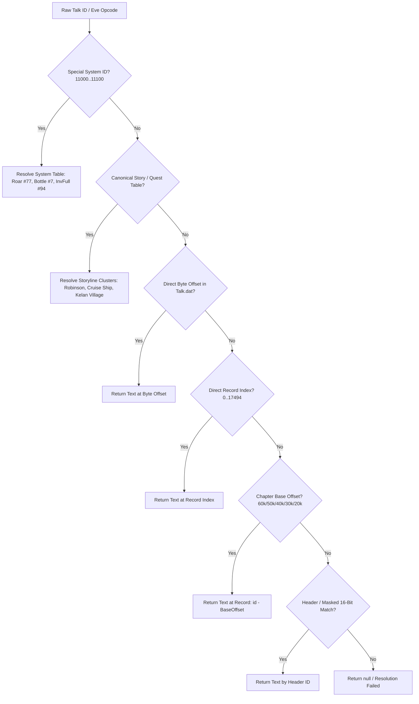

# Talk ID Resolver Architecture & Specification

## 1. Overview
The `TalkResolver` ([`PhoenixData/DataFiles/TalkResolver.cs`](file:///d:/GitHub/Wonderland-Private-Server/PhoenixData/DataFiles/TalkResolver.cs)) is a centralized, high-performance resolution engine designed to seamlessly translate raw bytecode dialogue identifiers and script opcodes emitted by `Eve.emg` into authentic English text strings from `Talk.dat`.

---

## 2. Resolution Hierarchy & Pipeline

When resolving any dialogue identifier `rawTalkId`:



### Hierarchy Breakdown:
1. **System & Interactive World Codes (`11000..11100`)**:
   - `11070` $\rightarrow$ Record #77: `"#swav1538/#sRoaring..."` (Sound effect + text for monster/dog roar).
   - `11007` $\rightarrow$ Record #7: `"The bottle has been destroyed."` (Drift bottle pickup / destruction).
   - `11005` $\rightarrow$ Record #5: `"The treasure box has been opened, there is nothing usable inside."`
   - `11006` $\rightarrow$ Record #6: `"The basket has been broken, there is nothing usable inside."`
   - `11008` $\rightarrow$ Record #8: `"The box has been destroyed."`
   - `11087` $\rightarrow$ Record #94: `"Not enough inventory space to trigger the event."`
   - `11000 + N` $\rightarrow$ Record `#N`.

2. **Canonical Storyline & Quest Clusters**:
   - **Robinson Island Beginner Tutorial & Raft (Map 10035 / 10036 Event 8)**:
     - `20304..20312` $\rightarrow$ Records `1400..1408`
     - `20317..20321` $\rightarrow$ Records `1413..1417`
     - `20322..20325` $\rightarrow$ Records `1418..1421`
     - `20326` $\rightarrow$ Record `1422`
     - `20354` $\rightarrow$ Record `1426`
     - `20355` $\rightarrow$ Record `1427`
   - **Robinson Pet Recruitment (Map 10036 Event 19)**:
     - `28422..28435` $\rightarrow$ Records `10863..10876`
   - **Cruise Ship Upper Deck & Cabin NPCs (Map 10001, 10017)**:
     - `30120` $\rightarrow$ Record `7021` (Gentleman)
     - `30124` $\rightarrow$ Record `7054` (Sailor collision report)
     - `30125` $\rightarrow$ Record `7055` (Captain collision response)
     - `30126` $\rightarrow$ Record `7026` (Visitor)
     - `30128` $\rightarrow$ Record `7034` (Crew)
     - `30130` $\rightarrow$ Record `7015` (Jack: *"I'm flying, Jack!"*)
     - `30131` $\rightarrow$ Record `7020` (Bellman)
     - `30137` $\rightarrow$ Record `7032` (Persian Cat: *"Meow~"*)
     - `30138` $\rightarrow$ Record `7033` (Girl)
     - `30141` $\rightarrow$ Record `7023` (Crew: *"I'm sailor here..."*)
     - `30142` $\rightarrow$ Record `7022` (Crew on Deck)
   - **Kelan Village Xaolan, Grandma, Hijackers, Mayor, Roca (Map 12001, 12002)**:
     - `30647..30659` $\rightarrow$ Records `7566..7578`
     - `30682..30692` $\rightarrow$ Records `7579..7587`
     - `30973..30980` $\rightarrow$ Records `7555..7561`
     - `31146` $\rightarrow$ Record `7586`

3. **Direct Byte Offset**: Direct lookup in `_talkByOffset[rawTalkId]`.
4. **Direct Record Index (0..17,494)**: Direct lookup in `_talkByIndex[rawTalkId]`.
5. **Universal Chapter Base Offsets**:
   - `rawTalkId >= 60000` $\rightarrow$ Record `rawTalkId - 60000`
   - `rawTalkId >= 50000` $\rightarrow$ Record `rawTalkId - 50000`
   - `rawTalkId >= 40000` $\rightarrow$ Record `rawTalkId - 40000`
   - `rawTalkId >= 30000` $\rightarrow$ Record `rawTalkId - 30000`
   - `rawTalkId >= 20000` $\rightarrow$ Record `rawTalkId - 20000`
6. **Explicit Header ID / Masked 16-Bit Lookup**:
   - `_talkById[rawTalkId]`
   - `_talkById[rawTalkId & 0xFFFF]`

---

## 3. Dynamic Token Processing

`TalkResolver` handles dynamic token parsing and substitution:
- `#n/#n` or `#n` $\rightarrow$ Player Character Name (defaults to "Adventurer" if null).
- `#s<sound>/#s` $\rightarrow$ Sound effect cue (e.g. `wav1538`).
- `#f<index>/#f` $\rightarrow$ Speaker portrait face frame index.
- `#[RGBY]/#[RGBY]` $\rightarrow$ In-game color styling tags.
- `StripFormatting(text)` $\rightarrow$ Returns clean plain text stripped of engine formatting markup.

---

## 4. API Reference

```csharp
public static class TalkResolver
{
    public static void Initialize(PhxTalkDat talkDat);
    public static string Resolve(uint rawTalkId, string playerName = null, bool stripFormatting = false);
    public static bool TryResolve(uint rawTalkId, out string dialogue, string playerName = null, bool stripFormatting = false);
    public static TalkResolutionResult ResolveDetailed(uint rawTalkId, string playerName = null);
    public static string FormatTokens(string text, string playerName);
    public static string StripFormatting(string text);
}
```

---

## 5. GUI Integration (MainForm1.cs)

The `💬 Talk ID Resolver` tab in the main server interface provides:
1. **Live ID & Offset Resolver**:
   - Input Talk ID / Byte Offset (`numResolverTalkId`).
   - Input Player Name for token `#n/#n` replacement (`txtResolverPlayerName`).
   - Resolution Status Bar showing Method, Record Index, Sound Cue, Face Portrait.
   - Raw & Decoded preview textbox.
2. **Searchable Master Dialogue Grid**:
   - Instant filtering by ID, Record Index, or substring in text.
   - Real-time row selection linked to the live resolver.
3. **In-Game Styled Bubble & Client Dispatcher**:
   - Rich preview with portrait indicators and audio cues.
   - Live Player dropdown to test sending dialogue packets (`AC 23:57`) directly to online clients.
